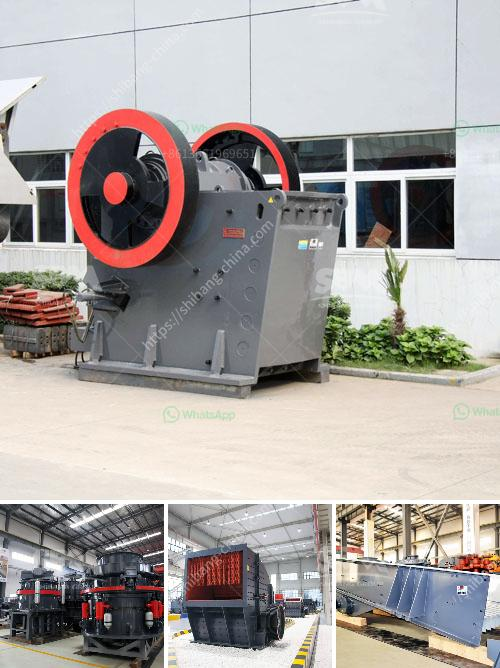

<h3>crusher equipment manufacturer</h3>
In the vast machinery industry, a crusher equipment manufacturer stands out for its commitment to quality, innovation, and customer satisfaction. These manufacturers play a vital role in various sectors such as mining, construction, recycling, and more by providing efficient and reliable crushing solutions. With cutting-edge technology and a strong focus on research and development, they are at the forefront of enabling progress and success for their customers.

First and foremost, crusher equipment manufacturers prioritize quality. They understand that their products need to withstand extreme conditions and heavy workloads. As a result, they use high-quality materials and adhere to stringent manufacturing standards. Their stringent quality control measures ensure that each machine leaving their production line is durable, reliable, and delivers optimal performance. This commitment to quality guarantees that their crushers can withstand the harshest environments and work efficiently for extended periods.

In addition to quality, crusher equipment manufacturers consistently invest in research and development to stay ahead of the curve. They understand that innovation is pivotal to meet evolving customer needs and ever-changing industry requirements. Through continuous innovation, these manufacturers introduce advanced features and technologies that enhance the efficiency, productivity, and safety of their crushers. They constantly seek ways to improve their machines, exploring new materials, design concepts, and engineering techniques to deliver the best possible solutions to their customers.

Moreover, customer satisfaction is of paramount importance to crusher equipment manufacturers. They strive to build long-term partnerships with their customers by offering excellent pre-sales and after-sales support. This includes providing comprehensive product information, technical guidance, and training to help customers make informed decisions and ensure optimal utilization of their crushers. In case of any issues or breakdowns, these manufacturers offer prompt and efficient support through their extensive service networks, minimizing downtime and maximizing productivity for their customers.

Furthermore, crusher equipment manufacturers are increasingly emphasizing environmentally-friendly solutions. They recognize the importance of sustainable practices in today's world and are committed to minimizing their ecological footprint. These manufacturers develop crushers that are energy-efficient, with reduced emissions and a focus on recycling and waste management. By providing eco-friendly solutions, they not only contribute to the environment but also enable their customers to comply with stringent environmental regulations.

Lastly, crusher equipment manufacturers understand that each customer has unique requirements. They offer a wide range of crushers, catering to different industries, applications, and specifications. Whether it is a jaw crusher, impact crusher, cone crusher, or any other type, these manufacturers ensure that their product portfolio meets diverse customer needs. They also provide customization options, enabling customers to tailor the machines to their specific requirements.

In conclusion, crusher equipment manufacturers are pivotal players in the machinery industry. Their commitment to quality, innovation, customer satisfaction, and sustainability sets them apart. By delivering robust and reliable crushers, they enable progress and success in various sectors. With continuous research and development, excellent customer support, and a wide range of offerings, these manufacturers are leading the way in the industry, driving growth, and meeting the evolving needs of their customers.
<h3>Contact us</h3><ul><li><strong>Whatsapp:&nbsp;<a href="https://wa.me/8613661969651">+8613661969651</a></strong></li><li><a href="https://swt.shibang-china.com/?git&amp;zhl&amp;crusher equipment manufacturer"><strong>Online Service(chat now)</strong></a></li></ul><h3>Related</h3><ul><li><a href='limestone and dolomite crusher plant.md'>limestone and dolomite crusher plant</a></li><li><a href='small stone crusher price in india.md'>small stone crusher price in india</a></li><li><a href='1 tonne roller mill.md'>1 tonne roller mill</a></li><li><a href='gold milling plant in zimbabwe.md'>gold milling plant in zimbabwe</a></li><li><a href='copper ore crushing machinery.md'>copper ore crushing machinery</a></li></ul>