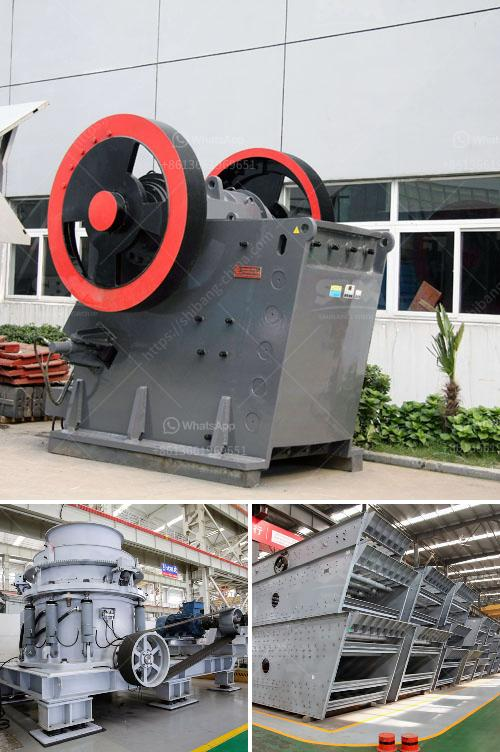

<h3>crusher for sale in pakistan</h3>
Crusher machines play an integral part in the mining industry where rocks and ores are utilized for construction purposes. However, acquiring these machines can be quite a daunting task, especially for those who are new to the industry. To help you navigate through this process, this article aims to provide you with all the necessary information about crushers for sale in Pakistan.

When looking for a crusher for sale, one should be aware of a variety of factors that contribute to its overall quality, efficiency, and durability. Some of these factors include the type of crusher, capacity, crushing ratio, and performance, among others. Therefore, it is crucial to conduct thorough research and explore the market to identify the most suitable crusher for your specific needs.

There are various types of crushers available in Pakistan, each serving a specific purpose. Some common types include jaw crushers, impact crushers, cone crushers, and even hydraulic cone crushers. Jaw crushers are primarily used for coarse crushing and are capable of processing large quantities of materials. Impact crushers, on the other hand, provide excellent reduction ratios for various medium to hard materials. Cone crushers are typically used for secondary or tertiary crushing, ensuring a more refined end product. Lastly, hydraulic cone crushers are suitable for crushing hard and abrasive materials, offering higher crushing efficiency.

One important aspect to consider when purchasing a crusher is its capacity, which determines its productivity. The capacity you require will depend on the size and the nature of the material you intend to crush. For instance, a larger capacity would be required for crushing stones compared to crushing coal. Therefore, it is essential to determine the expected workload and choose a crusher that can handle it efficiently.

Another crucial factor is the crushing ratio, which refers to the relative size of the final product compared to the input material. A higher crushing ratio indicates a finer and more uniform product. This ratio directly affects the quality of the end product, making it an important consideration when selecting a crusher.

Furthermore, the performance and durability of the crusher should not be overlooked. It is advisable to select a crusher from a reputable manufacturer to ensure a high-quality product that can withstand the demands of the mining industry. The crusher should be equipped with advanced features to provide optimal performance, such as adjustable settings for different material sizes and a reliable hydraulic system for safe and efficient operation.

In conclusion, choosing the right crusher for sale in Pakistan requires careful consideration of various factors, including the type of crusher, capacity, crushing ratio, and performance. As this industry demands a substantial investment, it is crucial to make an informed decision to maximize your return on investment. Take the time to research and explore the market to find the perfect crusher that meets your specific requirements. With the right crusher, you can efficiently process rocks and ores for construction purposes, ultimately contributing to the development of Pakistan's infrastructure sector.
<h3>Contact us</h3><ul><li><strong>Whatsapp:&nbsp;<a href="https://wa.me/8613661969651">+8613661969651</a></strong></li><li><a href="https://swt.shibang-china.com/?git&amp;zhl&amp;crusher for sale in pakistan"><strong>Online Service(chat now)</strong></a></li></ul><h3>Related</h3><ul><li><a href='portable rock crusher for sale.md'>portable rock crusher for sale</a></li><li><a href='ballast crusher for sale.md'>ballast crusher for sale</a></li><li><a href='stone crushing plants close to rotate.md'>stone crushing plants close to rotate</a></li><li><a href='slag quarry equipments supplies in algeria.md'>slag quarry equipments supplies in algeria</a></li><li><a href='crusher machine south africa.md'>crusher machine south africa</a></li></ul>