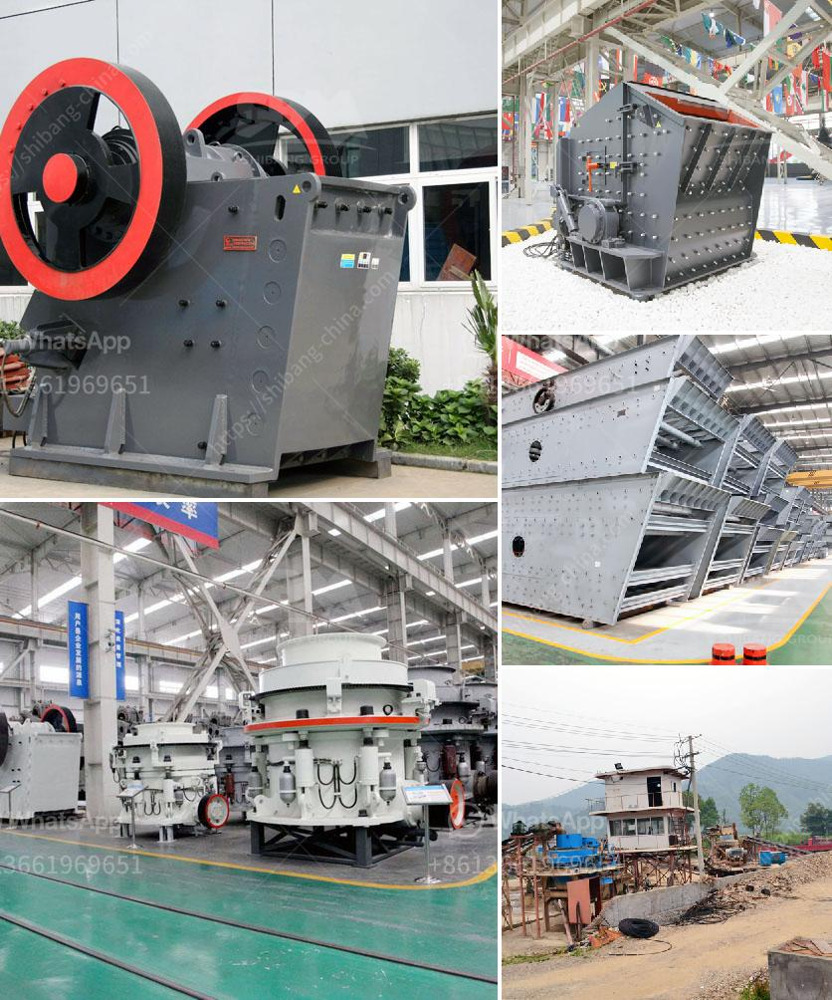

<h3>crusher gap crusher</h3>
In the world of crushing equipment, the crusher gap plays a significant role in the quality and efficiency of crushing operations. Also known as the crusher setting, the crusher gap determines the size of the crushed product from the primary crusher and affects the downstream processes. Understanding how to set the crusher gap properly is crucial for maximizing efficiency and ensuring the longevity of the crusher.

The crusher gap refers to the distance between the fixed and movable jaws or liners that form the crushing chamber. It determines the maximum size of particles that can be fed into the crusher, as well as the output size of the crushed material. Setting the crusher gap accurately is essential to achieve the desired product size while minimizing the risk of damage to the crusher and excessive wear on its components.

One of the main challenges in setting the crusher gap is finding the optimal balance between maximizing the production rate and maintaining the product quality. A narrow crusher gap setting can result in higher production rates, as more material is crushed in each cycle. However, this also increases the risk of creating fines or non-uniform products, which can negatively impact downstream processes or final product quality. On the other hand, a wider crusher gap allows for larger feed sizes and reduces the risk of producing fines, but it may sacrifice production rates.

To ensure an optimal crusher gap setting, it is important to consider the characteristics of the feed material, the desired product size, and the crusher type. Each crusher has specific requirements for the crusher gap setting, which can be adjusted manually or automatically depending on the sophistication of the crusher control system.

Manual adjustments of the crusher gap are usually performed by stopping the crusher and physically measuring the gap between the jaws. This method is simple but time-consuming and can be prone to human errors. Alternatively, crushers equipped with automated control systems can offer real-time monitoring and adjustment of the crusher gap. These systems use sensors to measure the crusher gap and adjust it dynamically based on the desired product size or other predetermined parameters. Automated crusher gap control not only saves time but also ensures consistent and accurate gap settings, increasing the overall efficiency of the crushing process.

Regularly checking and adjusting the crusher gap is crucial for maintaining the performance and longevity of the crusher. Any changes in the crusher gap can have significant effects on the crushing process, such as reducing the production capacity, increasing wear on the liners, or causing unwanted downtime. Therefore, it is recommended to include routine crusher gap inspections as part of the overall maintenance program.

In conclusion, the crusher gap is a critical factor in achieving efficient and high-quality crushing operations. A properly set crusher gap maximizes production rates while maintaining the desired product size and minimizing wear on the crusher. Whether manually adjusted or automated, frequent inspection and adjustment of the crusher gap are essential to ensure optimal performance and prolonged lifespan of the crusher. By prioritizing the crusher gap, operators can ensure efficient and cost-effective crushing processes that meet the demands of various applications.
<h3>Contact us</h3><ul><li><strong>Whatsapp:&nbsp;<a href="https://wa.me/8613661969651">+8613661969651</a></strong></li><li><a href="https://swt.shibang-china.com/?git&amp;zhl&amp;crusher gap crusher"><strong>Online Service(chat now)</strong></a></li></ul><h3>Related</h3><ul><li><a href='price rock crusher peru.md'>price rock crusher peru</a></li><li><a href='ball milling method.md'>ball milling method</a></li><li><a href='stone crushing equipment price in nigeria.md'>stone crushing equipment price in nigeria</a></li><li><a href='demolition plants crushers in lima.md'>demolition plants crushers in lima</a></li><li><a href='minister of gold mining ghana.md'>minister of gold mining ghana</a></li></ul>