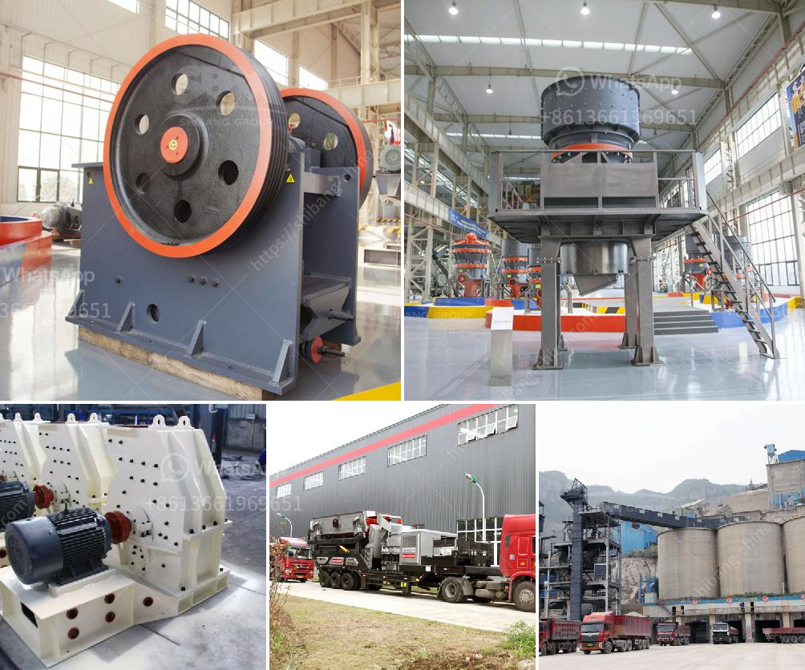

<h3>crusher jagged roller crusher plate</h3>
When it comes to crushing materials efficiently and effectively, having the right equipment is crucial. One such indispensable equipment for crushing large rocks or ores into smaller, more manageable sizes is the crusher. Among the many types of crushers available in the market, the jagged roller crusher plate stands out for its exceptional performance and durability.

The jagged roller crusher plate is designed to withstand heavy-duty crushing operations in industries such as mining, construction, and recycling. Its robust construction and unique design make it suitable for crushing even the hardest materials. The plate consists of several jagged teeth, which help in breaking down the materials into smaller pieces.

One of the key advantages of the jagged roller crusher plate is its versatility. It can be used to crush a wide range of materials, including limestone, granite, iron ore, and even concrete. This makes it a preferred choice for various industrial applications. Additionally, the plate's jagged teeth ensure a uniform and consistent crushing performance, delivering high-quality end products.

Another significant feature of the jagged roller crusher plate is its ease of maintenance. The design allows for quick and straightforward access to the teeth, facilitating easy replacement or maintenance. This not only saves time but also reduces downtime, contributing to higher productivity and efficiency.

Furthermore, the jagged roller crusher plate is built to last. Its heavy-duty construction and high-quality materials ensure durability and longevity even under harsh operating conditions. This significantly reduces the need for frequent replacements or repairs, further enhancing its cost-effectiveness.

In terms of performance, the jagged roller crusher plate excels in delivering consistent results. Its unique tooth design ensures a progressive crushing action, reducing the chances of blockages or material jamming. This promotes a smooth and uninterrupted crushing process, leading to high throughput and optimal productivity.

Additionally, the plate's robust design minimizes vibrations and noise during operation, creating a safer and more comfortable working environment. The reduced noise levels can be particularly beneficial in noise-sensitive areas or when crushing operations are carried out near residential areas.

When it comes to choosing the right crusher plate, it is essential to consider factors such as the material being crushed, the desired output size, and the specific requirements of the application. The jagged roller crusher plate offers a versatile and reliable solution that meets these criteria effectively.

In conclusion, the jagged roller crusher plate is a superior choice for crushing applications that demand efficiency, durability, and versatility. Its robust construction, unique tooth design, and ease of maintenance make it a go-to option for various industries. By investing in the jagged roller crusher plate, businesses can enhance their crushing operations' performance while achieving cost savings in the long run.
<h3>Contact us</h3><ul><li><strong>Whatsapp:&nbsp;<a href="https://wa.me/8613661969651">+8613661969651</a></strong></li><li><a href="https://swt.shibang-china.com/?git&amp;zhl&amp;crusher jagged roller crusher plate"><strong>Online Service(chat now)</strong></a></li></ul><h3>Related</h3><ul><li><a href='3 roller raymond mill india.md'>3 roller raymond mill india</a></li><li><a href='raymond roller mill drawings.md'>raymond roller mill drawings</a></li><li><a href='vibrating feeder zenith.md'>vibrating feeder zenith</a></li><li><a href='objective of ball mill machine.md'>objective of ball mill machine</a></li><li><a href='buy stone crusher india.md'>buy stone crusher india</a></li></ul>