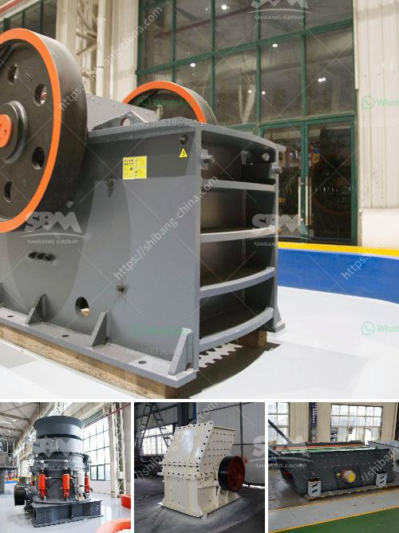

<h3>crusher jaw crusher</h3>
A crusher is a machine that breaks down solid materials into smaller pieces by compressing them. There are different types of crushers available in the market, but the jaw crusher is one of the most popular ones. This crusher is made of two vertical jaws, one is stationary and the other one is movable. The material is fed into the top of the crusher and is crushed between the two jaws.

The jaw crusher is widely used in the mining and construction industry due to its high efficiency in crushing and durability. It can crush various materials, including granite, pebble, basalt, limestone, quartz, river stone, sandstone, shale, iron ore, copper ore, building construction, construction waste, etc. The jaw crusher is capable of crushing rocks with a compressive strength of up to 320 MPa.

One of the main advantages of the jaw crusher is its ability to process large feed size and produce a wide range of discharge sizes. This makes it suitable for a variety of applications, including primary crushing, secondary crushing, and final crushing stages. Additionally, the jaw crusher is versatile and easy to operate, making it a preferred choice for many users.

The jaw crusher consists of a fixed jaw plate and a movable jaw plate. When the feed material enters the crushing chamber, the moving jaw pushes it against the fixed jaw plate, causing it to be crushed. The crushed material is then discharged through the discharge opening at the bottom of the crusher. The size of the discharge opening can be adjusted to control the final product size.

In addition to its high crushing capacity and adjustable discharge opening, the jaw crusher also has other features that enhance its performance and efficiency. It has a simple structure, which makes it easy to maintain and repair. The jaw plates are made of high-resistant materials, which increase its lifespan and reduce maintenance costs. Moreover, the jaw crusher is equipped with a reliable and efficient hydraulic system, which ensures smooth and fast operation.

When choosing a jaw crusher, it is important to consider factors such as the type of material to be crushed, the desired product size, and the required capacity. Additionally, the user should also consider the cost and availability of spare parts and the overall operating and maintenance costs.

In conclusion, the jaw crusher is a reliable and efficient machine that is widely used in the mining and construction industry. Its versatility and high crushing capacity make it suitable for a variety of applications. With proper maintenance and regular inspections, the jaw crusher can provide years of trouble-free operation and reliable performance.
<h3>Contact us</h3><ul><li><strong>Whatsapp:&nbsp;<a href="https://wa.me/8613661969651">+8613661969651</a></strong></li><li><a href="https://swt.shibang-china.com/?git&amp;zhl&amp;crusher jaw crusher"><strong>Online Service(chat now)</strong></a></li></ul><h3>Related</h3><ul><li><a href='calcium carbonate plants in china.md'>calcium carbonate plants in china</a></li><li><a href='vibrating feeder sinter oret.md'>vibrating feeder sinter oret</a></li><li><a href='crusher plant for sale in texas.md'>crusher plant for sale in texas</a></li><li><a href='how to find out to crushing capacity of ball mill.md'>how to find out to crushing capacity of ball mill</a></li><li><a href='grinding machine kuwait for sale.md'>grinding machine kuwait for sale</a></li></ul>