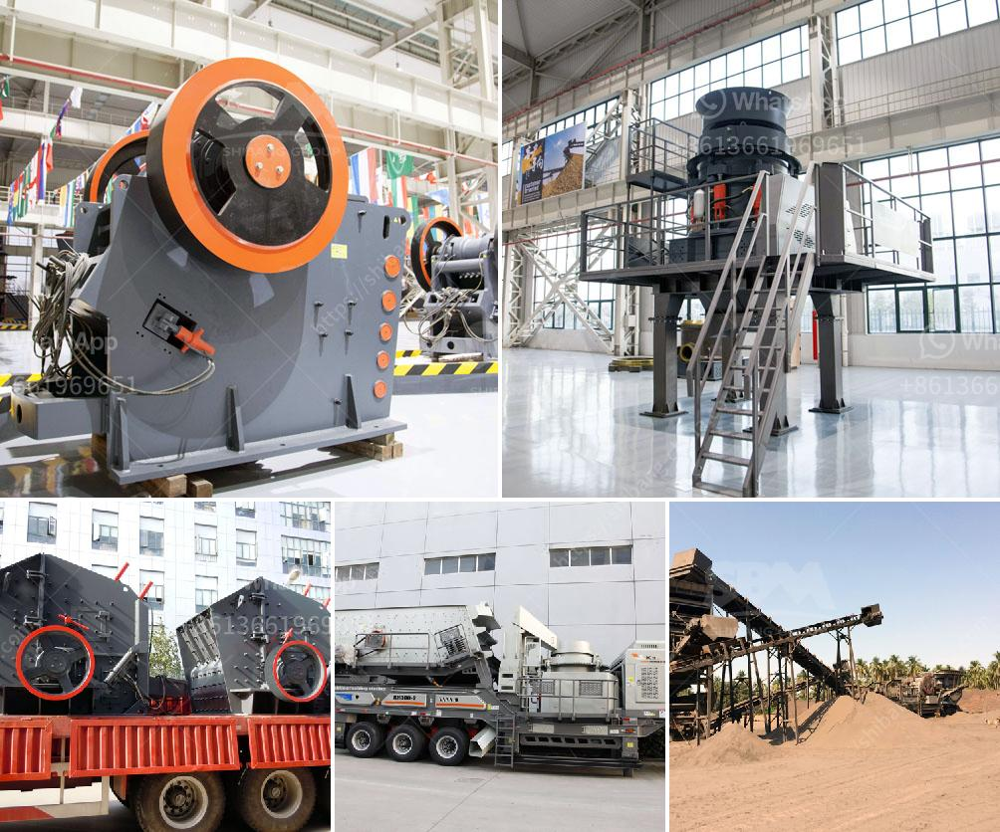

<h3>crusher machine capacity 5 tons per hour</h3>
Crusher machines are prevalent in the mining and quarrying industry where they are used to break down larger rocks into smaller, more manageable pieces. These robust machines are designed to handle high capacities and heavy loads, enabling them to process impressive amounts of material efficiently. One popular model in this category is the crusher machine with a capacity of 5 tons per hour.

The crusher machine with a capacity of 5 tons per hour allows operators to increase production significantly, making it an economical and efficient option for large-scale construction projects. This modular machine is highly versatile, allowing various types of material such as granite, basalt, limestone, and even concrete to be processed effectively. The crushed material can then be used for a variety of applications, including road construction, building foundations, and landscaping projects.

The primary feature of this crusher machine is its strong and durable construction. It is built using high-quality materials that guarantee its longevity, even under heavy-duty usage conditions. The robust steel frame is designed to withstand the intense forces generated during the crushing process, preventing any structural damage. Additionally, the reinforced crushers ensure minimal wear and tear, reducing the need for frequent maintenance, thus saving time and money in the long run.

Furthermore, the crusher machine offers a range of adjustable settings, allowing operators to customize the output size according to their specific requirements. This flexibility is particularly advantageous when dealing with different materials and project specifications. The machine can be easily adjusted to produce various sizes of crushed material, ensuring it meets the desired standards for use in different applications.

Another key feature worth mentioning is the energy efficiency of this crusher machine. Despite its high capacity, it operates with a low power consumption, minimizing energy costs and reducing the carbon footprint. This eco-friendly approach is crucial for businesses looking to operate sustainably and minimize their environmental impact.

The crusher machine's user-friendly interface makes it simple to operate, even for less experienced operators. It features intuitive controls and clear indicators that provide real-time information about the machine's performance. Moreover, its safety features, such as emergency stops and protective guards, ensure the well-being of the operators and prevent accidents in the workplace.

In conclusion, the crusher machine with a capacity of 5 tons per hour is an essential equipment in the mining and quarrying industry. It can be used to break larger rocks into smaller, more manageable pieces, allowing for easier processing and subsequent use. With its robust construction, adjustable settings, and energy-efficient operation, this machine offers a cost-effective solution for increasing production in high-demand projects.
<h3>Contact us</h3><ul><li><strong>Whatsapp:&nbsp;<a href="https://wa.me/8613661969651">+8613661969651</a></strong></li><li><a href="https://swt.shibang-china.com/?git&amp;zhl&amp;crusher machine capacity 5 tons per hour"><strong>Online Service(chat now)</strong></a></li></ul><h3>Related</h3><ul><li><a href='indian river sand grinding machine price.md'>indian river sand grinding machine price</a></li><li><a href='cement factory for sale in andra pradesh.md'>cement factory for sale in andra pradesh</a></li><li><a href='to separate manganese and iron ore.md'>to separate manganese and iron ore</a></li><li><a href='aggregate vibrating screens.md'>aggregate vibrating screens</a></li><li><a href='new mobile and fixed rock crushing plant.md'>new mobile and fixed rock crushing plant</a></li></ul>