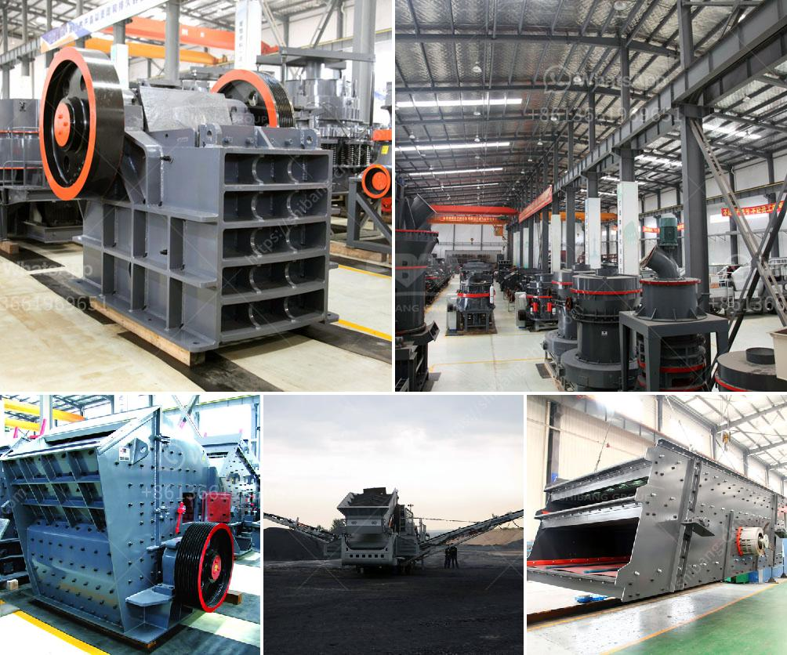

<h3>crusher machine china</h3>
China is known for its robust manufacturing industry, with a wide range of products being produced and exported around the world. One of the key manufacturing sectors in China is the machinery industry, which includes the production of various types of machinery and equipment. Among these, the crusher machine industry plays an important role in China's manufacturing sector.

Crusher machines are used for crushing various materials into smaller size for further processing. Crushers can be divided into different types, such as jaw crushers, impact crushers, cone crushers, and so on. The market demand for crusher machines is constantly growing, so the manufacturers of these machines are also increasing.

China is one of the leading manufacturers and exporters of crusher machines in the world. With its fast-growing economy, China has become a major market for crusher machines. The Chinese government has been supporting the development of the machinery industry, including the crusher machine industry. There are many crusher machine manufacturers in China, including international manufacturers like Sandvik, Metso, and Terex, as well as domestic manufacturers like ZENITH, Liming Heavy Industry, and Shibang Industry & Technology Group.

China's crusher machine industry has gained a massive boost in recent years due to the increasing demand from within the country as well as from the global market. The rapid development of infrastructure projects in China, such as the construction of highways, railways, and airports, has led to a huge demand for construction materials, which in turn has driven the growth of the crusher machine industry. Furthermore, the mining industry in China is also expanding rapidly, creating a need for crusher machines to extract, crush, and process various minerals.

China's crusher machine industry is known for its competitive pricing, as manufacturers in China have the advantage of lower labor and production costs compared to other countries. This has made China a preferred destination for many buyers looking for cost-effective crusher machines. In addition, the quality of crusher machines manufactured in China has also improved significantly over the years, with many manufacturers investing in research and development to enhance the performance and durability of their machines.

However, it is important for buyers to be cautious when purchasing crusher machines from China. As with any industry, there are both reputable manufacturers and those who produce substandard products. It is recommended to research and select reputable manufacturers with a proven track record of producing high-quality crusher machines. Buyers should also pay attention to the after-sales service provided by the manufacturers, as this can be crucial in case of any issues or problems with the machines.

In conclusion, China's crusher machine industry has experienced significant growth in recent years, driven by the increasing demand for construction materials and minerals. With its competitive pricing and improved quality, the crusher machine industry in China is well-positioned to meet the needs of both domestic and international markets. However, buyers should exercise caution and choose reputable manufacturers to ensure they get reliable and high-quality crusher machines.
<h3>Contact us</h3><ul><li><strong>Whatsapp:&nbsp;<a href="https://wa.me/8613661969651">+8613661969651</a></strong></li><li><a href="https://swt.shibang-china.com/?git&amp;zhl&amp;crusher machine china"><strong>Online Service(chat now)</strong></a></li></ul><h3>Related</h3><ul><li><a href='iron ore processing plant in mexico.md'>iron ore processing plant in mexico</a></li><li><a href='roll crusher for various size coal.md'>roll crusher for various size coal</a></li><li><a href='ball mills price south africa.md'>ball mills price south africa</a></li><li><a href='mica crushing processing in nigeria.md'>mica crushing processing in nigeria</a></li><li><a href='impact crusher philippines.md'>impact crusher philippines</a></li></ul>