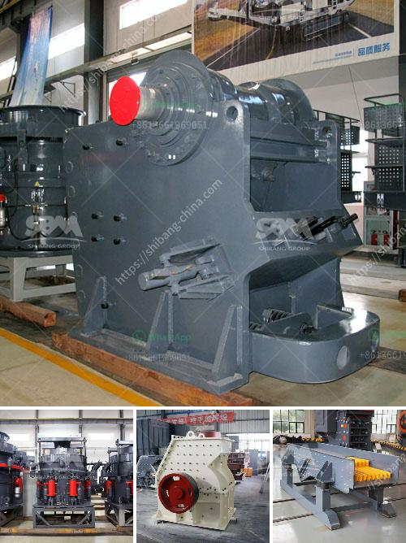

<h3>crusher machine for making sand from stone</h3>
Crusher machines are widely used in the mining industry for reducing the size of stones and ores. These machines handle large rocks and ores and turn them into crushed stone, sand or gravel. These machines are incredibly efficient and can be operated by remote control. They are generally used in the construction industry for producing aggregates such as sand, gravel, and crushed stone.

One particular crusher machine that is characteristic of the mining industry is the jaw crusher. It is widely used in a variety of fields due to its relatively low cost and easy maintenance. This machine can crush large rocks into smaller ones, thereby reducing the size of the stones and making them suitable for further processing.

The jaw crusher operates by conducting a compression-type crushing. In this process, the stones are squeezed between two plates that move towards each other. They continue to move closer until the rock is crushed into smaller pieces. The machine is capable of producing different sizes of crushed stones, which can be used for various applications such as road construction, building foundations, and landscaping.

In addition to jaw crushers, there are also other types of crushers that are used for similar purposes, such as impact crushers and cone crushers. These machines work on different principles but ultimately achieve the same goal of reducing the size of stones.

One of the main advantages of using crusher machines for making sand from stone is that they produce a more consistent and uniform product compared to natural sand. The grains of sand produced by these machines have a well-defined shape and are free of impurities. This makes them suitable for use in construction, as they can provide better strength and durability compared to natural sand.

Crusher machines for making sand from stone are also environmentally friendly. They reduce the need for mining and reduce the amount of waste generated. Additionally, these machines can be powered by renewable energy sources such as solar or wind power, further reducing their environmental impact.

Furthermore, crusher machines are highly versatile and can produce different types of sand depending on the requirements. For example, some machines are specifically designed to produce fine sand, while others can produce coarse sand. This flexibility allows users to choose the type of sand that best suits their specific needs.

In conclusion, crusher machines for making sand from stone have revolutionized the mining industry. They make the process of converting large rocks into smaller particles much easier and more efficient. The final product is a high-quality sand that can be used in various applications in the construction industry. These machines are environmentally friendly and can be powered by renewable energy sources. With their versatility and ability to produce different types of sand, they are truly a valuable tool for the mining industry.
<h3>Contact us</h3><ul><li><strong>Whatsapp:&nbsp;<a href="https://wa.me/8613661969651">+8613661969651</a></strong></li><li><a href="https://swt.shibang-china.com/?git&amp;zhl&amp;crusher machine for making sand from stone"><strong>Online Service(chat now)</strong></a></li></ul><h3>Related</h3><ul><li><a href='mining equipment for hire zimbabwe.md'>mining equipment for hire zimbabwe</a></li><li><a href='profitable cement plant for sale in tamilnadu.md'>profitable cement plant for sale in tamilnadu</a></li><li><a href='ball mill prices and for sale ghana.md'>ball mill prices and for sale ghana</a></li><li><a href='450 tph limestone crusher.md'>450 tph limestone crusher</a></li><li><a href='floatation equipment for mining for sale in south africa.md'>floatation equipment for mining for sale in south africa</a></li></ul>