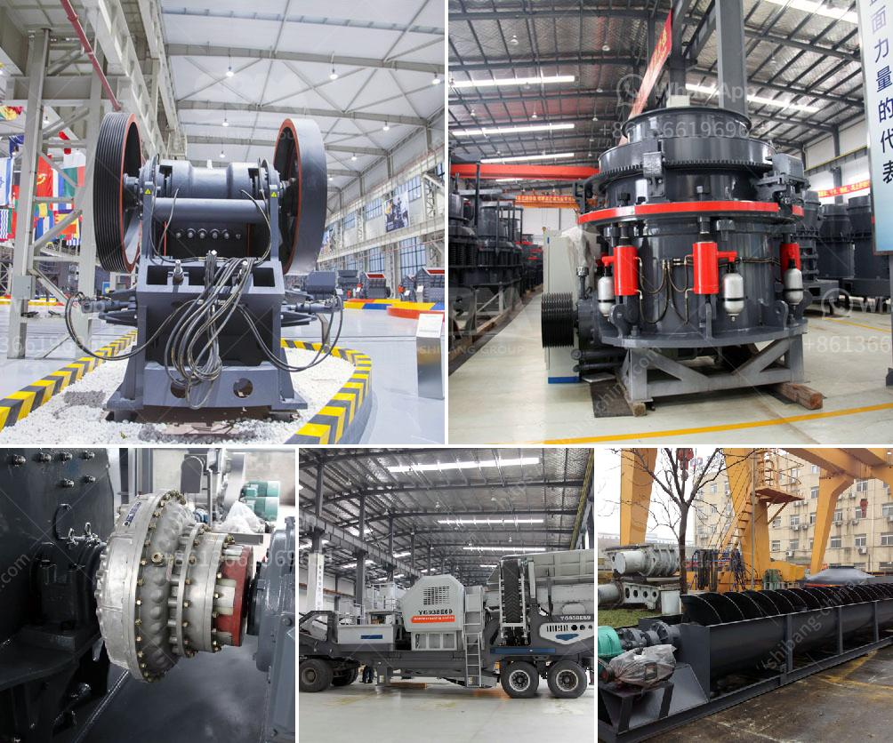

<h3>crusher machine for sale in ethiopia</h3>
Crusher machines in Ethiopia are designed to crush various types of ore and minerals, which can be used for industrial purposes such as crushing granite, limestone, basalt, quartz, river pebbles, iron ore, copper ore, etc. With the increasing demands for these materials in construction, mining, and other industries, the need for crushers is growing rapidly.

One of the popular crusher machines available for sale in Ethiopia is the jaw crusher. This machine is characterized by its simple structure, reliable performance, easy maintenance, and low operating costs. It is widely used in mining, metallurgy, building materials, highway, railway, water conservancy, and chemical industries. The jaw crusher in Ethiopia can crush materials with a compressive strength of not more than 320MPa, and there are two types of crushers: coarse jaw crusher and fine jaw crusher.

The impact crusher is another commonly used crusher machine in Ethiopia. It is used to crush medium-hard stones such as limestone, pebble, granite, etc., to process various ores. It has a wide range of applications in the construction and mining industries due to its high efficiency and low operating costs. The impact crusher in Ethiopia works by providing a strong impact force to the materials, which results in the crushing of the stones into smaller sizes.

Lastly, the cone crusher is another high-performance crusher machine for sale in Ethiopia. It works by squeezing the material between an eccentrically gyrating spindle and a concave hopper. This machine is mostly used in crushing hard and abrasive materials, making it ideal for crushing rock, limestone, and other challenging materials. The cone crusher is widely used in the construction, mining, and aggregates industry.

In conclusion, crusher machines play a vital role in the development of Ethiopia's construction and mining industries. With the advancement of technology and the growing demands for materials, these machines have become essential equipment for various applications. Whether it is for crushing granite, limestone, or other minerals, there is a wide range of crusher machines available for sale in Ethiopia. Potential buyers should consider factors such as the machine's capacity, power, efficiency, and operating costs before making a purchase decision.
<h3>Contact us</h3><ul><li><strong>Whatsapp:&nbsp;<a href="https://wa.me/8613661969651">+8613661969651</a></strong></li><li><a href="https://swt.shibang-china.com/?git&amp;zhl&amp;crusher machine for sale in ethiopia"><strong>Online Service(chat now)</strong></a></li></ul><h3>Related</h3><ul><li><a href='iron crushing machine.md'>iron crushing machine</a></li><li><a href='slag processing plant price in ghana.md'>slag processing plant price in ghana</a></li><li><a href='business plan for crushing and screening.md'>business plan for crushing and screening</a></li><li><a href='prices crusher prices gypsum crusher prices.md'>prices crusher prices gypsum crusher prices</a></li><li><a href='methods of hammer mill.md'>methods of hammer mill</a></li></ul>