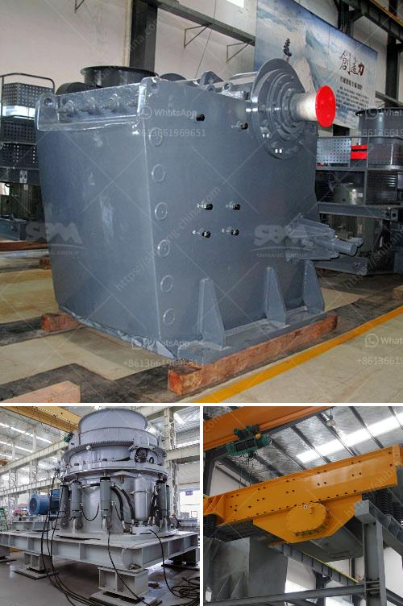

<h3>crusher machine from south philippines</h3>
The growing trend of population expansion, urbanization, rapid economic development, and industrialization has led to increased waste generation and environmental pollution in many parts of the world. The Southern Philippines is no exception. In order to combat these challenges and preserve our natural resources, innovative solutions are being developed, including the introduction of sophisticated crusher machines. These machines are playing a crucial role in recycling and waste management in the region.

A crusher machine is a useful tool used for reducing the size of waste materials. It effiiciently breaks down various types of waste materials such as limestone, biomass, industrial waste, and municipal waste. By shredding the waste material, it reduces the volume and size of the material, which helps to minimize waste disposal costs.

One of the prominent crusher machine manufacturers in the Southern Philippines is Aimix Machinery. Aimix is dedicated to producing and supplying high-quality crusher machines that are suitable for processing various kinds of materials. These machines are designed to meet the specific requirements of each customer, ensuring efficiency and productivity.

One popular crusher machine offered by Aimix is the horizontal shaft impact crusher. This machine is primarily used for crushing materials such as limestone, granite, and concrete. It adopts the principle of "stone-on-stone" crushing to ensure efficiency and productivity. It is equipped with a heavy-duty rotor and a high-speed vibrating grizzly feeder for optimal performance. This crusher machine is widely used in aggregate production, mining, and demolition applications, making it an ideal choice for customers in the Southern Philippines.

Another innovative crusher machine offered by Aimix is the vertical shaft impact crusher. This machine is designed to produce high-quality aggregates, including sand and gravel, for the construction industry. With its unique rotor structure, it can generate highly efficient crushing performance, ensuring a high crushing ratio and high output capacity. The vertical shaft impact crusher is an ideal choice for producing manufactured sand. Its application in the Southern Philippines has helped local builders to convert waste materials into valuable products, contributing to the sustainable development of the region.

In addition to their crushing capabilities, the crusher machines supplied by Aimix also incorporate advanced features for ease of operation and maintenance. These features include hydraulic adjustment of the crusher settings, remote control operation, and a user-friendly control panel. This ensures that operators can easily adjust the machine to meet their specific requirements and achieve optimal production results.

The introduction of crusher machines from Aimix Machinery has revolutionized waste management and recycling in the Southern Philippines. The machines not only help in reducing waste disposal costs but also contribute to preserving the environment and promoting sustainable development. With their high efficiency and productivity, these crusher machines have become essential tools in the construction, mining, and waste management industries.

In conclusion, crusher machines from the Southern Philippines, provided by companies such as Aimix Machinery, are essential tools for efficient recycling and waste management. These machines not only reduce waste volume but also contribute to the sustainable development of the region. With their advanced features and high-performance capabilities, crusher machines have become a game-changer in the industry, helping to preserve natural resources and reduce environmental pollution.
<h3>Contact us</h3><ul><li><strong>Whatsapp:&nbsp;<a href="https://wa.me/8613661969651">+8613661969651</a></strong></li><li><a href="https://swt.shibang-china.com/?git&amp;zhl&amp;crusher machine from south philippines"><strong>Online Service(chat now)</strong></a></li></ul><h3>Related</h3><ul><li><a href='types of conveyor belts.md'>types of conveyor belts</a></li><li><a href='crushing aggregates companies in philippines.md'>crushing aggregates companies in philippines</a></li><li><a href='quratz crusher price.md'>quratz crusher price</a></li><li><a href='65 tph cone crusher complete plant.md'>65 tph cone crusher complete plant</a></li><li><a href='sand and gravel separator machine for sale philippines.md'>sand and gravel separator machine for sale philippines</a></li></ul>