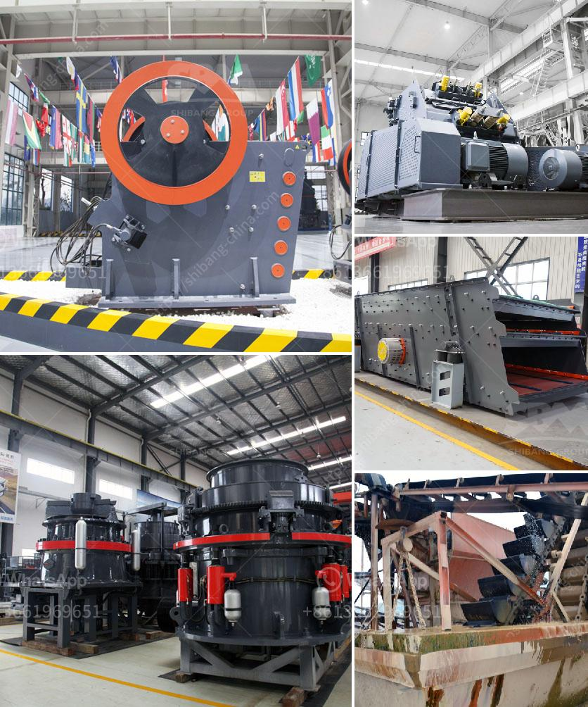

<h3>crusher machine making in pakistan</h3>
Crusher machines are used for crushing of various materials in the recycling and construction industries. These machines help to reduce the volume of waste material and make it usable again. Crusher machines are also used for crushing of coal, stone, and various other materials. These machines are capable of crushing large chunks into smaller pieces and making them easy to transport and use.

The crusher machines in Pakistan are widely used in the mining, construction, and quarrying industries. Many different types of crusher machines are available in Pakistan, such as jaw crushers, roller crushers, and hammer crushers. These machines are designed with different structures and specifications, depending on the nature of the material to be processed.

Crusher machines have become a popular choice among industries due to their ability to crush materials efficiently and economically. They provide a cost-effective solution for reducing waste material and making it usable again. These machines are equipped with strong and durable parts that provide efficient performance and longer service life.

One of the most commonly used crusher machines in Pakistan is the jaw crusher. It is widely used in the primary crushing of various materials, such as rock, ore, and stone. The jaw crusher is mainly designed for crushing bulky and hard materials, but it can also be used to crush lighter materials such as limestone and coal.

Other types of crusher machines in Pakistan include impact crushers, hammer crushers, cone crushers, and roller crushers. Each of these machines has its own unique features and specifications, allowing them to be used in different applications. For example, an impact crusher is commonly used for crushing feed materials, such as limestone, while a hammer crusher is used for crushing brittle materials, such as coal and limestone.

In Pakistan, crusher machines are sold by various manufacturers and suppliers. Some of them are also involved in the manufacturing of crusher machines. These machines are made with high-quality materials to ensure durability and efficient performance. They are also available in various sizes and capacities to meet the diverse needs of different industries.

The crusher machine industry in Pakistan is relatively new compared to other industries, but it has been growing rapidly in recent years. With the increasing demand for crusher machines, the manufacturers and suppliers in Pakistan are working together to improve the technology and production capacity. They are also focusing on providing better after-sales services to their customers to ensure maximum customer satisfaction.

In conclusion, crusher machines are playing a crucial role in the recycling and construction industries in Pakistan. They help in reducing waste material and making it usable again. These machines are available in different types and sizes to meet the diverse needs of different industries. With the continuous efforts of manufacturers and suppliers, the crusher machine industry in Pakistan is expected to grow further and contribute significantly to the country's economy.
<h3>Contact us</h3><ul><li><strong>Whatsapp:&nbsp;<a href="https://wa.me/8613661969651">+8613661969651</a></strong></li><li><a href="https://swt.shibang-china.com/?git&amp;zhl&amp;crusher machine making in pakistan"><strong>Online Service(chat now)</strong></a></li></ul><h3>Related</h3><ul><li><a href='philippines mining equipment companies.md'>philippines mining equipment companies</a></li><li><a href='grinder mill bogota.md'>grinder mill bogota</a></li><li><a href='diamond mining jaw crusher.md'>diamond mining jaw crusher</a></li><li><a href='stone crushers for sale in philippines.md'>stone crushers for sale in philippines</a></li><li><a href='stone quarry crusher equipment.md'>stone quarry crusher equipment</a></li></ul>