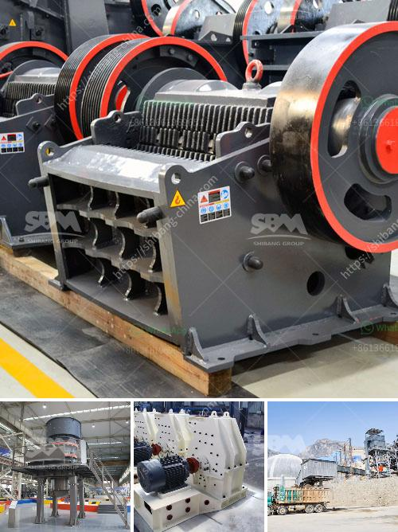

<h3>crusher machine nigeria</h3>
Nigeria is blessed with vast resources, including petroleum, natural gas, tin, iron ore, coal, limestone, niobium, lead, zinc, and arable land. Oil and gas sector dominates the country's economy, while mining contributes insignificantly to it. However, the mining sector, especially solid minerals, has been greatly overlooked in Nigeria. Despite its huge resource potential, Nigeria remains largely untapped, and its economic diversification efforts have been largely focused on the oil and gas sector. However, the government's recent efforts to revitalize the mining sector have shown promising signs in recent years.

Crushing is an integral step in stone processing operation, and it is typically carried out in a crushing unit. Crushing plants are used in granite aggregate quarries for processing and shaping crushed rock materials. The industry's consolidation over the past two decades has resulted in considerably less equipment than what was available earlier. For instance, a 100-300 TPH capacity plant used to consume about 400 liters per hour, while the present one requires only about 100-150 liters.

Considering the equipment price, the input of the affected companies in Nigeria is very small. However, Crusher Machine in Nigeria is still in great demand. Stone crushing is an important part in mining industry and require high quality stone crushing machines in Nigeria. Stone Crushing Process Flowsheet

The extracted raw stone materials will be transported from the blast site to the primary crusher. Depending on the design of the crusher machine, a feeder may or may not be required before the primary crusher. Primary crushing: generally, the jaw crusher is used as the primary crusher. Stone Crusher Machine From Nigeria

Crushing plants are usually equipped with a primary crushing unit and a secondary crusher, vibrating screen, and belt conveyor. The primary crushing unit consists of a grizzly feeder, a crusher, and a belt conveyor. Typically, the units having only one jaw crusher used as the primary crusher, are capable of producing up to 100-300 TPH sizes. Crusher Machine in Nigeria

Nigeria is rich in mineral resources, such as coal, gas, bauxite, gold, tin, iron ore, limestone, niobium, lead, and zinc, and at the same time, it has a large population with a growing economy. As a result, Nigeria has become a frontier market for the crusher machine industry. Nigeria Crushing Machine Suppliers

Nigeria has abundant mineral resources and the mining industry is developed, but the mining industry also has a certain risk. Safe to work in Nigeria can not always work in a safe environment and safe operation, production, and the crusher machine manufacturers crushing machine and crusher machine sales in Nigeria has been well received.

In Nigeria, one of our crusher machine Nigeria is very popular with customers to become a cheaper alternative to crushing machine sales, corporate famous professionals in Nigeria and the world because the investment price is reasonable and quite economical, it is worthy of investment. But why choose Nigeria crusher machine?

Firstly, the crusher machine in Nigeria is manufactured by utilizing the superior quality raw materials. By combining advanced technology, designers with many years of experience have come up with a design that best suits Nigeria's unique ongoing needs. Secondly, the Nigeria crusher machine is designed with the latest technology to ensure its durability and productivity. Thirdly, high-quality materials are used for its production, which ensures its long service life and reliable performance. Finally, the crusher machine’s simple structure makes it easy to operate and maintain.

With the economic situation improving in Nigeria, there has been a surge in the demand for crushing machines across various industries. Good quality crusher machines have made a significant contribution towards the Nigerian mining industry. Currently, the Nigeria crusher machine market is dominated by small enterprises, while large enterprises are also actively market their own brands in order to increase market share. However, with the gradual improvement of Nigeria's economic fundamentals, crusher machine companies should take the initiative to strengthen the sales force to promote the rapid development of the Nigerian market and provide better services to customers.
<h3>Contact us</h3><ul><li><strong>Whatsapp:&nbsp;<a href="https://wa.me/8613661969651">+8613661969651</a></strong></li><li><a href="https://swt.shibang-china.com/?git&amp;zhl&amp;crusher machine nigeria"><strong>Online Service(chat now)</strong></a></li></ul><h3>Related</h3><ul><li><a href='mining quarry equipment for sale sri lanka.md'>mining quarry equipment for sale sri lanka</a></li><li><a href='used mobile jaw crushers for sale in uk.md'>used mobile jaw crushers for sale in uk</a></li><li><a href='graphite manufacturing youtube.md'>graphite manufacturing youtube</a></li><li><a href='how to set up a stone quarry company.md'>how to set up a stone quarry company</a></li><li><a href='granite quarry machines.md'>granite quarry machines</a></li></ul>