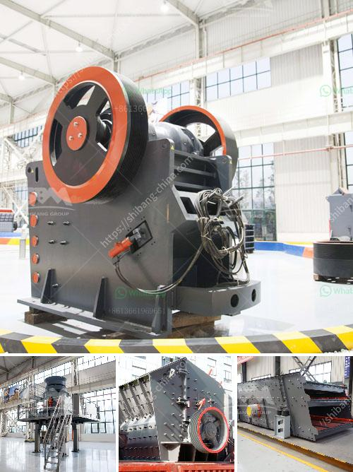

<h3>crusher machine price in saudi</h3>
Crusher machines play an essential role in the mining and construction industry. It can crush different types of materials, including limestone, granite, pebbles, dolomite, anthracite, and more. Crusher machines are widely used in mining, and their demand has seen a steady rise in recent years.

The market for crusher machines in Saudi Arabia has been on the rise since they have become an essential tool for all types of construction activities. The development of new infrastructure projects such as airports, railway lines, and highways has driven the growth of the crusher machine market. Additionally, the expanding mining industry has further boosted the demand for crushers.

One of the critical factors that affect the overall cost of a crusher machine in Saudi Arabia is the crusher machine price in Saudi. The higher the price, the higher the final cost. On the other hand, the crusher machine price in Saudi is not the only factor to consider when buying a crusher machine. Its efficiency, reliability, and longevity must also be taken into account.

However, the price of a crusher machine is undoubtedly an important factor as it determines the feasibility and affordability of the investment. Different types of crushers are available in the market with varying prices based on their features, specifications, and capabilities. For instance, jaw crushers are generally more expensive than impact crushers due to their higher production capacity and reliability.

The crusher machine price in Saudi can vary significantly depending on the manufacturer and supplier. To get the best deal, it is essential to compare various crusher machine suppliers and their prices. By doing thorough research and requesting quotes from different suppliers, one can find a high-quality crusher machine at a competitive price.

Moreover, investing in a crusher machine can bring numerous benefits to businesses in Saudi Arabia. Here are some of the advantages of using a crusher machine:

1. Increased Efficiency: Crusher machines can significantly increase the efficiency of the crushing process, saving time and manpower. With a reliable crusher machine, large quantities of materials can be processed efficiently and consistently.

2. Cost Saving: Crusher machines can help businesses save money on the production process. By crushing materials on-site, transportation costs can be reduced, and extra expenses for purchasing aggregate materials can be avoided.

3. Versatility: Crusher machines are available in various sizes and types, allowing businesses to select the most suitable one for their specific needs. Whether it is for primary crushing or secondary crushing, there is a crusher machine designed to meet the requirements.

4. Reduced Environmental Impact: Crusher machines are designed to minimize the environmental impact caused by the extraction and processing of raw materials. By crushing and recycling materials, businesses can contribute to a more sustainable approach to construction and mining activities.

In conclusion, the crusher machine market in Saudi Arabia is witnessing significant growth due to the increasing demand for construction materials and the expanding mining industry. When investing in a crusher machine, price is a crucial factor to consider. However, the efficiency, reliability, and longevity of the machine should not be overlooked. By conducting extensive research and comparing prices from different suppliers, businesses in Saudi Arabia can find a top-quality crusher machine at a competitive price. Investing in a crusher machine brings numerous benefits, including increased efficiency, cost savings, versatility, and a reduced environmental impact.
<h3>Contact us</h3><ul><li><strong>Whatsapp:&nbsp;<a href="https://wa.me/8613661969651">+8613661969651</a></strong></li><li><a href="https://swt.shibang-china.com/?git&amp;zhl&amp;crusher machine price in saudi"><strong>Online Service(chat now)</strong></a></li></ul><h3>Related</h3><ul><li><a href='silica sand stone machine china.md'>silica sand stone machine china</a></li><li><a href='malaysia used conveyor belt for sale.md'>malaysia used conveyor belt for sale</a></li><li><a href='vertical grinding machine black and dacker.md'>vertical grinding machine black and dacker</a></li><li><a href='used sweco screening equipment for sale.md'>used sweco screening equipment for sale</a></li><li><a href='crusher plant in construction.md'>crusher plant in construction</a></li></ul>