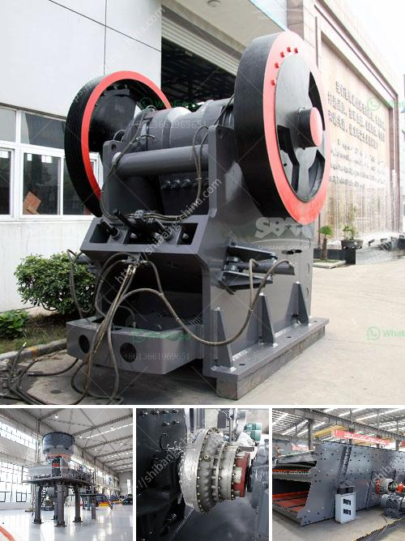

<h3>crusher machine south africa</h3>
South Africa is a country of profound economic disparities. The Gini coefficient, a measure of income inequality, reveals that the country has one of the highest rates in the world. With around 20 percent of the population living in extreme poverty, it is crucial to focus on efforts that can help uplift those in need. The crusher machine industry in South Africa is not an exception. What began as a simple idea has quickly turned into a divisive industry that has been labeled by some critics as a menace to the South African economy.

Crusher machines are used to break rocks and stones into smaller pieces. These machines have become an essential tool for many industries, including mining, agriculture, and construction. With so many machines operating across the country, the crusher machine industry undoubtedly plays a significant role in South Africa's economic growth.

However, the rapid expansion of this industry has come at a cost. One of the most significant concerns associated with crusher machine use is the environmental impact. These machines release harmful emissions into the air, which pollute the environment and pose severe health risks to nearby communities.

Additionally, the crusher machine industry's expansion has led to an oversaturation of the market. Many small-scale operators have entered the field, resulting in intense competition and a subsequent decline in prices. This has made it increasingly challenging for established businesses to remain profitable.

Another concerning issue is the lack of regulations and enforcement in the crusher machine industry. Although there are guidelines and safety protocols in place, they are often neglected or ignored altogether. This lack of oversight puts workers at risk of injury, and also allows substandard crusher machines to flood the market, further compromising safety standards.

The socioeconomic impact of a poorly regulated crusher machine industry cannot be ignored. With unsustainable business practices, small-scale operators are driven into bankruptcy, leading to job losses and worsening the unemployment rate. This exacerbates the already dire economic situation faced by many South Africans.

To address these issues, it is imperative for the South African government to create and enforce stricter regulations for the crusher machine industry. This includes implementing emissions standards and safety protocols and establishing a system for monitoring and penalizing non-compliant operators. By doing so, the government can ensure that the industry operates sustainably, minimizing its negative impact on the environment and public health.

Moreover, it is vital for the South African government to invest in alternative and sustainable technologies that could replace the current crusher machines being used. This would not only help mitigate environmental damage but also create new job opportunities and stimulate economic growth.

In conclusion, South Africa's crusher machine industry is confronted with numerous challenges, including environmental pollution, market oversaturation, and inadequate regulation. To address these concerns, the government must adopt a proactive approach that promotes sustainable practices and supports the development of alternative technologies. Through this, South Africa can strike a balance between economic growth and the well-being of its citizens.
<h3>Contact us</h3><ul><li><strong>Whatsapp:&nbsp;<a href="https://wa.me/8613661969651">+8613661969651</a></strong></li><li><a href="https://swt.shibang-china.com/?git&amp;zhl&amp;crusher machine south africa"><strong>Online Service(chat now)</strong></a></li></ul><h3>Related</h3><ul><li><a href='300tpd cement plant price.md'>300tpd cement plant price</a></li><li><a href='manufacturer of conveyor belts.md'>manufacturer of conveyor belts</a></li><li><a href='dolomite powder making equipment.md'>dolomite powder making equipment</a></li><li><a href='rock crushing machines.md'>rock crushing machines</a></li><li><a href='kaolin clay processing line.md'>kaolin clay processing line</a></li></ul>