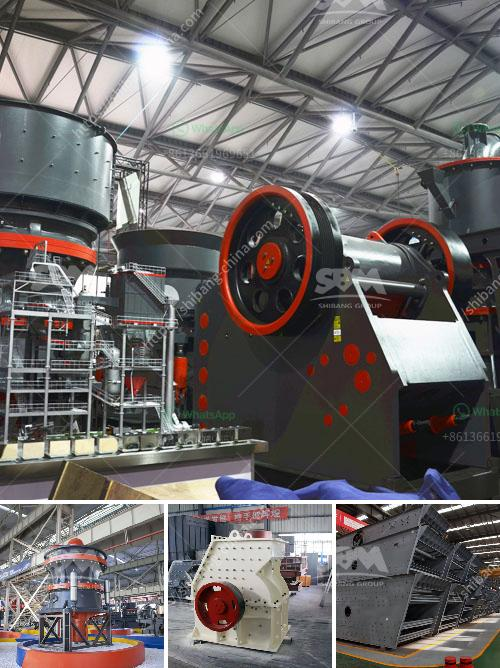

<h3>crusher machine supplier</h3>
A crusher machine supplier plays a crucial role in the construction industry as they provide the essential equipment which helps in breaking down large rocks or pieces of concrete into smaller pieces for construction purposes. These machines are active participants in various projects, such as road construction, building demolitions, and infrastructure developments.

One of the key benefits of having a reliable crusher machine supplier is the availability of different types of crushers. They offer a wide range of machines, including jaw crushers, cone crushers, impact crushers, and vertical shaft impact crushers. Each type of crusher has its own unique features and advantages, making it suitable for specific construction needs.

Moreover, a reputable crusher machine supplier ensures that the machines they provide are of top quality. These machines are made with robust materials and advanced technology, ensuring durability and efficient performance. With their expertise, they carefully select and supply machines that have the capacity to withstand extreme conditions and heavy-duty operations.

Another important aspect to consider when selecting a crusher machine supplier is their after-sales support. A reliable supplier not only helps in procuring the right equipment but also provides timely maintenance and repair services. They have skilled technicians who can address any issues or breakdowns promptly, ensuring minimal downtime and uninterrupted workflow at construction sites.

In addition to the quality of machines and after-sales support, a good crusher machine supplier also offers competitive pricing and flexible payment options. They understand the budget constraints of their clients and strive to provide cost-effective solutions without compromising on the quality of the equipment.

In conclusion, a crusher machine supplier is an indispensable asset in the construction industry. They provide a wide range of machines, ensure top quality, offer excellent after-sales support, and provide competitive pricing. Choosing the right supplier can significantly contribute to the success of construction projects, making them more efficient, cost-effective, and durable.
<h3>Contact us</h3><ul><li><strong>Whatsapp:&nbsp;<a href="https://wa.me/8613661969651">+8613661969651</a></strong></li><li><a href="https://swt.shibang-china.com/?git&amp;zhl&amp;crusher machine supplier"><strong>Online Service(chat now)</strong></a></li></ul><h3>Related</h3><ul><li><a href='best mill for wet grinding of calcium carbonate.md'>best mill for wet grinding of calcium carbonate</a></li><li><a href='sayaji impact crusher specifications.md'>sayaji impact crusher specifications</a></li><li><a href='crushing plants for sale.md'>crushing plants for sale</a></li><li><a href='marble crusher industry philippines.md'>marble crusher industry philippines</a></li><li><a href='prices crusher prices gypsum crusher prices.md'>prices crusher prices gypsum crusher prices</a></li></ul>