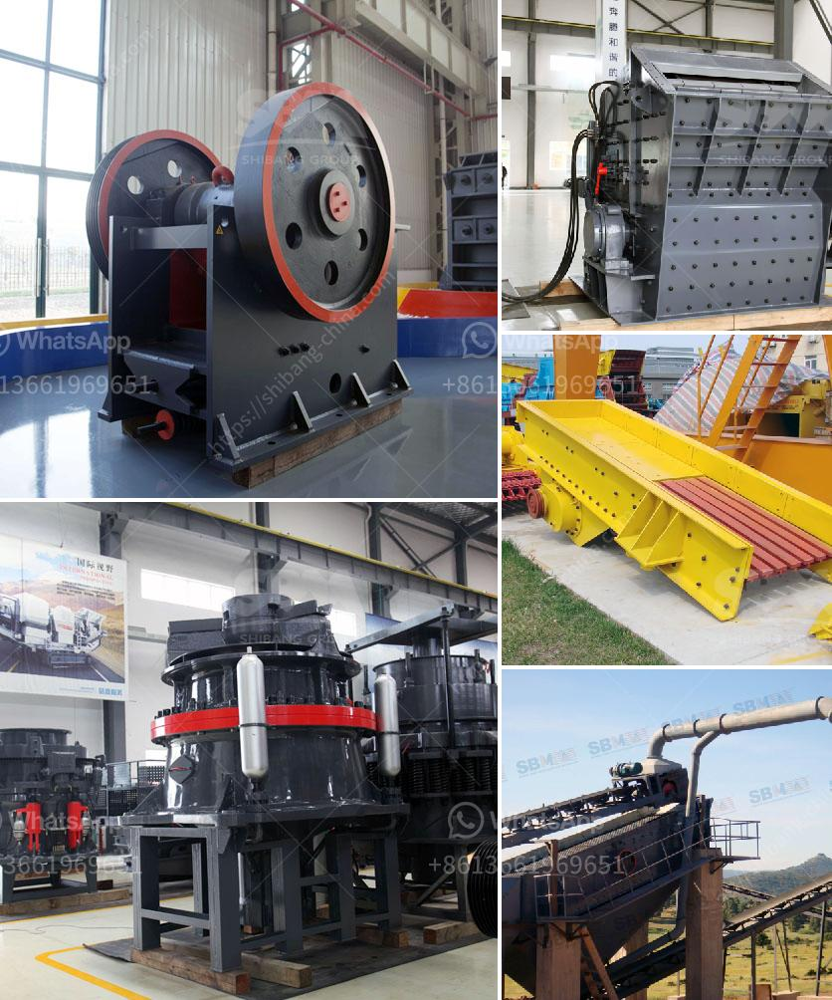

<h3>crusher manufacturers in europe</h3>
Crusher manufacturers in Europe are designed to provide efficient crushing of various types of minerals, ores, and other bulk materials. Construction and recycling industries are the primary sectors where crushers are used.

Crusher manufacturers in Europe usually offer a range of various machines, such as cone crushers, jaw crushers, and impact crushers. They represent a highly flexible and manageable approach towards construction, recycling, and mining applications. They can be equipped with various types of crushing tools, such as jaw plates, blow bars, and vertical impact plates to suit different needs.

One of the major advantages of crushers over other equipment is their ability to handle a wide range of feed particle sizes. Crushers can handle larger rocks, ores, and other materials with a higher crushing ratio and higher output. Crushers are often used in mining operations and recycling industries, where they offer quicker and more efficient crushing of materials compared to traditional crushing techniques.

Europe is a competitive region, not only for its manufacturing industries but also for its technological advancements. There are numerous crusher manufacturers in Europe who excel in their services and provide quality machines for various construction and recycling applications. Out of these, some of the primary players in the European market include:

1. Metso: Metso is a Finnish company that has been a leading crusher manufacturer in Europe for over 150 years. They have been renowned for their high-quality and state-of-the-art crushers and their exceptional customer service.

2. Sandvik: Sandvik is a Swedish company that offers a huge range of crushers, including jaw crushers, cone crushers, and impact crushers. Their crushers are designed to handle a wide range of applications and are used extensively in the mining and construction industries.

3. Thyssenkrupp: Thyssenkrupp is a German company that offers a wide range of crushers, including jaw crushers, cone crushers, and impact crushers. They provide reliable and efficient crushing solutions for various industries, including mining, quarrying, and recycling.

4. McCloskey: McCloskey is an Irish company known for manufacturing a range of crushers, including jaw crushers, impact crushers, and cone crushers. Their crushers are reliable, durable, and highly efficient, making them a top choice for many European customers.

These are just a few examples of the crusher manufacturers in Europe who offer quality machines for various applications. The European market for crushers is highly competitive, with constant technological advancements and increasing environmental regulations. Crusher manufacturers have to constantly innovate and upgrade their machines to meet the changing demands of the market.

Overall, crusher manufacturers in Europe are key players in the construction and recycling industries. They offer a wide range of machines for various applications, ensuring efficient and high-quality crushing of materials. With technological advancements and the need for sustainable solutions, crusher manufacturers in Europe will continue to play a significant role in the industry.
<h3>Contact us</h3><ul><li><strong>Whatsapp:&nbsp;<a href="https://wa.me/8613661969651">+8613661969651</a></strong></li><li><a href="https://swt.shibang-china.com/?git&amp;zhl&amp;crusher manufacturers in europe"><strong>Online Service(chat now)</strong></a></li></ul><h3>Related</h3><ul><li><a href='portable sand grinding machine.md'>portable sand grinding machine</a></li><li><a href='used stone crusher in pakistan.md'>used stone crusher in pakistan</a></li><li><a href='iron ore used crusher machine.md'>iron ore used crusher machine</a></li><li><a href='roller mill for onions.md'>roller mill for onions</a></li><li><a href='stone crusher price.md'>stone crusher price</a></li></ul>