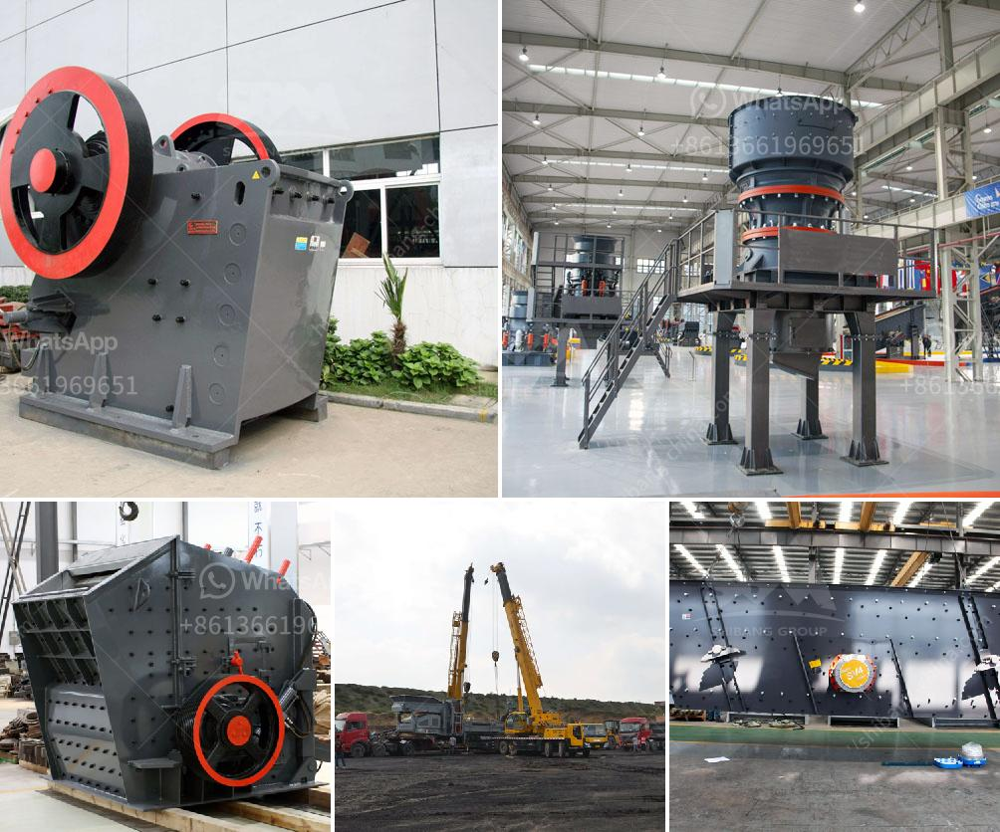

<h3>crusher manufacturers in germany</h3>
Germany is a country renowned for its engineering prowess and quality manufacturing standards. This reputation is primarily due to the wide range of crusher manufacturers that call Germany home. Germany is well-known for its automotive and electronics industries, but it is also a global leader when it comes to machinery and equipment manufacturing. Crusher manufacturers in Germany are known for their high-quality production and durability, making them the perfect choice for various industrial applications.

Germany is home to many crusher manufacturers. One of the leading suppliers of crushers in Germany is Metso. Metso offers a wide range of products, such as stone crushers, screeners, scalpers, and feeders. In addition, they also provide a range of wear and spare parts. With more than 150 years of experience, Metso has gained a global reputation for delivering high-quality products that are built to last.

Another well-known crusher manufacturer in Germany is RUBBLE MASTER. For over 30 years, RUBBLE MASTER has been manufacturing and distributing durable recycling and crushing solutions. Their crushers are used in numerous applications, such as construction and demolition waste recycling, asphalt and concrete recycling, and natural rock crushing. RUBBLE MASTER crushers are known for their compact size, ease of transport, and high performance.

Germany is also home to Kleemann, another prominent crusher manufacturer. Kleemann specializes in mobile crushing and screening solutions for the construction and mining industry. Their product range includes mobile jaw crushers, mobile cone crushers, mobile impact crushers, and mobile screens. Kleemann crushers and screens are known for their robustness, reliability, and high performance.

One of the unique selling points of German crusher manufacturers is their focus on environmental sustainability. Many German manufacturers are committed to developing and producing eco-friendly crushers. They utilize innovative technologies to reduce emissions, increase energy efficiency, and minimize waste generation. For instance, RUBBLE MASTER offers crushers with low fuel consumption and low noise levels, making them environmentally friendly choices for crushing operations.

In addition to these well-known manufacturers, Germany also houses a multitude of smaller crusher manufacturers. These companies often specialize in niche markets or cater to specific customer requirements. They provide customized solutions and tailor-made crushers for unique applications. These smaller manufacturers contribute to Germany's rich and diverse crusher manufacturing landscape.

Overall, Germany is a hub for crusher manufacturing, with numerous reputable manufacturers offering a wide range of durable and efficient crushers. With their engineering expertise and commitment to innovation, these manufacturers ensure that their products meet the highest quality standards. Whether it is for construction, mining, or recycling, German crushers are renowned for their reliability, performance, and longevity. When it comes to crusher manufacturers, Germany is undoubtedly a force to be reckoned with in the global market.
<h3>Contact us</h3><ul><li><strong>Whatsapp:&nbsp;<a href="https://wa.me/8613661969651">+8613661969651</a></strong></li><li><a href="https://swt.shibang-china.com/?git&amp;zhl&amp;crusher manufacturers in germany"><strong>Online Service(chat now)</strong></a></li></ul><h3>Related</h3><ul><li><a href='chrome ore washing plant.md'>chrome ore washing plant</a></li><li><a href='calcium carbonate manufacturing machinery.md'>calcium carbonate manufacturing machinery</a></li><li><a href='start m sand unit kerala cost.md'>start m sand unit kerala cost</a></li><li><a href='kaolin processing crusher uganda.md'>kaolin processing crusher uganda</a></li><li><a href='4 roller mill nigeria.md'>4 roller mill nigeria</a></li></ul>