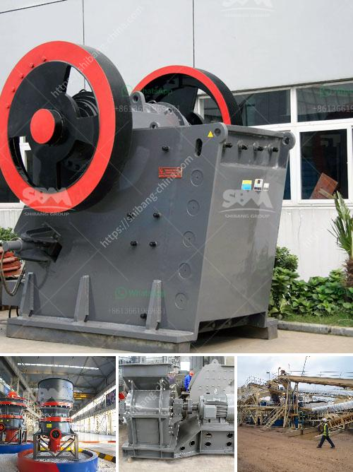

<h3>crusher manufacturers in saudi</h3>
Crusher manufacturers in Saudi Arabia are thriving and are indeed a key component in the country's overall industrial development. Crusher production is a major part of any lucrative mining operation and the manufacturers of these machines understand the importance of reliability, performance, and timely delivery. Hence, they partner with each other to accelerate their production capabilities and cater to the ever-increasing demands of the construction and mining sectors in Saudi Arabia.

There are numerous crusher manufacturers in Saudi Arabia, operating both locally and globally. These manufacturers have a unique blend of expertise gained from different parts of the world, servicing Saudi Arabia's booming construction industry. Each individual company profiled in this article is a prime example of excellence in design, production, and customer satisfaction, assuring the nation's success in constructing safe and sustainable infrastructure.

One such leading crusher manufacturer is Salbookh Crushers. With a team of experienced professionals and state-of-the-art machinery, they boast a strong foothold in the region. Their crushers are designed to withstand even the toughest of conditions and are capable of producing high-quality aggregate for construction purposes.

Another notable crusher manufacturer is Extec. The company has earned a reputation as a leading innovator in the design and production of crushers and screeners. They focus on meeting the specific needs of their customers while ensuring durability, versatility, and superior performance.

Meanwhile, HAZEMAG is a world-renowned crusher manufacturer and has become synonymous with high-quality crushing equipment. They manufacture a wide range of machines that are used in various industries, including mining, cement, and aggregates.

In conclusion, crusher manufacturers in Saudi Arabia are thriving and provide excellent equipment with high-quality standards for the construction industry. Furthermore, companies like Salbookh Crushers, MB Crusher, and HAZEMAG are playing a crucial role in the crushing equipment industry by providing reliable, highly efficient, and economical crushing solutions. We hope to continue playing a significant role in pushing Saudi Arabia's infrastructure forward by providing state-of-the-art crushing equipment.
<h3>Contact us</h3><ul><li><strong>Whatsapp:&nbsp;<a href="https://wa.me/8613661969651">+8613661969651</a></strong></li><li><a href="https://swt.shibang-china.com/?git&amp;zhl&amp;crusher manufacturers in saudi"><strong>Online Service(chat now)</strong></a></li></ul><h3>Related</h3><ul><li><a href='cone crusher sri lanka for sale.md'>cone crusher sri lanka for sale</a></li><li><a href='kenya jaw crusher is manufactured.md'>kenya jaw crusher is manufactured</a></li><li><a href='gypsum making machine india.md'>gypsum making machine india</a></li><li><a href='cost of granite crushing equipment.md'>cost of granite crushing equipment</a></li><li><a href='sand crushing and screening hire.md'>sand crushing and screening hire</a></li></ul>