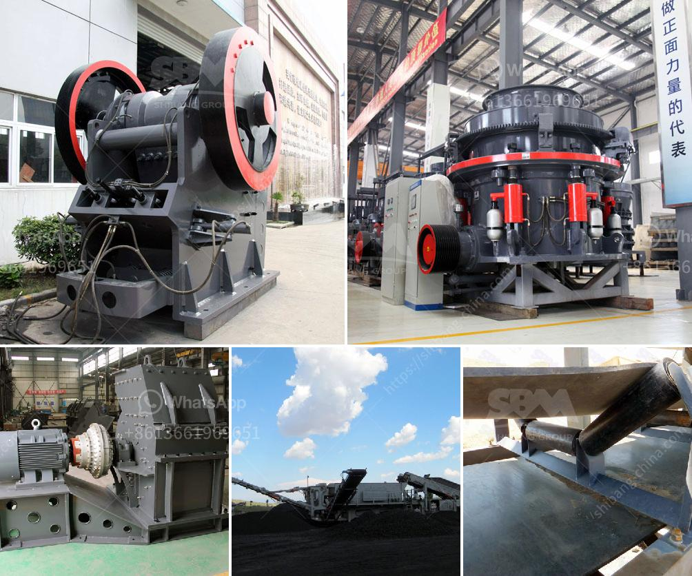

<h3>crusher materials cone crusher mining</h3>
A cone crusher is a mining equipment that reduces the size of feed material by squeezing or compressing it between an eccentrically gyrating spindle, which is covered by a wear-resistant mantle, and an enclosing concave hopper. As the feed material enters the top of the cone crusher, it becomes wedged and squeezed between the mantle and hopper, effectively crushing the material into smaller pieces.

When it comes to choosing the right materials for a cone crusher, there are several factors to consider. The most important ones include the type of rock or ore being crushed, the hardness of the material, and the desired output size. Here are some popular options for selecting the crusher materials:

1. Manganese Steel: This is the most common material for cone crusher liners. It is known for its ability to withstand high impact and abrasive wear, making it suitable for mining applications. However, manganese steel can be quite brittle and may break easily, especially under heavy loads or impacts.

2. High Chrome Iron: High chrome iron is another popular choice for cone crusher liners due to its excellent wear resistance. It offers better abrasion resistance compared to manganese steel but may not be as impact-resistant. This material is often suitable for crushing harder rocks or ores.

3. Martensitic Steel: Martensitic steel is a type of alloy steel that is known for its high strength and toughness. It provides excellent impact resistance and can handle heavy-duty applications. Martensitic steel is often used in cone crusher mantle and concave applications where high impact and maximum abrasion resistance are required.

4. Ceramic Inserts: Some manufacturers offer cone crusher liners with ceramic inserts. These inserts are made from specialized ceramic materials that provide exceptional wear resistance. Ceramic inserts are particularly useful in handling extremely abrasive materials or when the crusher needs to achieve finer output sizes.

In conclusion, selecting the right materials for a cone crusher is critical for optimizing its performance and prolonging its lifespan. Each material has its unique properties, and the choice depends on the specific application and desired crushing outcome. Factors like material hardness, abrasive properties, and size reduction requirements should be considered when deciding on the crusher material for mining operations.
<h3>Contact us</h3><ul><li><strong>Whatsapp:&nbsp;<a href="https://wa.me/8613661969651">+8613661969651</a></strong></li><li><a href="https://swt.shibang-china.com/?git&amp;zhl&amp;crusher materials cone crusher mining"><strong>Online Service(chat now)</strong></a></li></ul><h3>Related</h3><ul><li><a href='portable cone crusher.md'>portable cone crusher</a></li><li><a href='mini cement plant tons per day.md'>mini cement plant tons per day</a></li><li><a href='quratz crusher price.md'>quratz crusher price</a></li><li><a href='the process of limestone.md'>the process of limestone</a></li><li><a href='cheap stone crushing plant.md'>cheap stone crushing plant</a></li></ul>