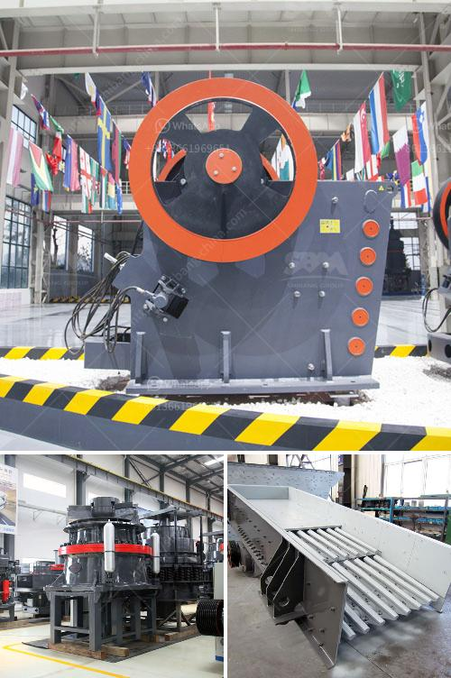

<h3>crusher on rent basis in nigeria</h3>
Crushers are one of the most essential machines used in the mining and quarrying industry. They are also used to break large rocks into smaller sized rocks, gravel, or even dust. Renting a crusher on a monthly basis has become a popular option for both quarry owners and contractors in Nigeria.

The high cost of buying new crushers drives many quarry owners to rent machines. This saves them money upfront, as well as the cost of maintenance and repairs down the line. Additionally, investing in rental crushers allows contractors to take on more projects without worrying about the capital investment required to purchase their equipment.

One of the main advantages of renting a crusher is the flexibility it offers. Quarry owners and contractors can rent crushers for short or long periods, adjusting the terms of the rental agreement to suit their specific needs. Whether it's a one-time project or an ongoing contract, renting a crusher allows for easy adaptation to changing demands.

Renting crushers in Nigeria also comes with the benefit of technical support. Rental companies provide trained operators and experienced technicians who can assist with machine setup and maintenance. This ensures that the crushers are operated efficiently and in compliance with safety standards. Technical support eliminates the need to hire additional staff or invest in training programs for existing employees.

Another advantage of crusher rentals is the availability of a wide range of models and sizes. Rental companies offer a diverse selection of crushers, allowing quarry owners and contractors to choose the most suitable machine for their specific application. Whether it's a jaw crusher, cone crusher, or impact crusher, there are rental options available to match various crushing requirements.

Furthermore, renting crushers can be a cost-effective option, especially for smaller quarry operations. Instead of investing a significant amount of money upfront, quarry owners can allocate their funds towards other aspects of their business, such as expanding their fleet, hiring additional personnel, or investing in marketing efforts.

In conclusion, renting a crusher on a monthly basis is a convenient and cost-effective solution for quarry owners and contractors in Nigeria. It provides the flexibility to adapt to changing demands, the availability of technical support, and a wide range of crusher options. By opting for rentals, businesses can save money upfront, streamline their operations, and focus on growing their business. So, if you are in need of a crusher in Nigeria, consider the advantages of renting and make an informed decision that aligns with your specific needs.
<h3>Contact us</h3><ul><li><strong>Whatsapp:&nbsp;<a href="https://wa.me/8613661969651">+8613661969651</a></strong></li><li><a href="https://swt.shibang-china.com/?git&amp;zhl&amp;crusher on rent basis in nigeria"><strong>Online Service(chat now)</strong></a></li></ul><h3>Related</h3><ul><li><a href='stone crusher machine for sale kenya.md'>stone crusher machine for sale kenya</a></li><li><a href='stone crusher for hire in durban.md'>stone crusher for hire in durban</a></li><li><a href='cs series cone crusher agents in south africa.md'>cs series cone crusher agents in south africa</a></li><li><a href='project feasibility report on stone crusher.md'>project feasibility report on stone crusher</a></li><li><a href='china vibrating screen.md'>china vibrating screen</a></li></ul>