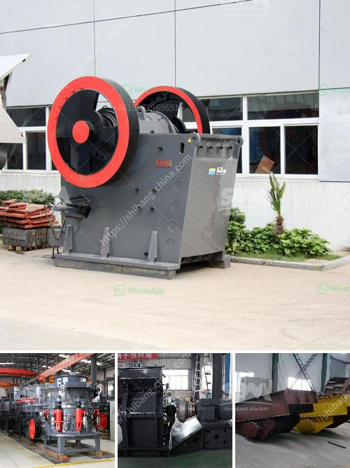

<h3>crusher on rent in india</h3>
With the increasing demand for construction materials in India, the need for robust and reliable crushers is on the rise. To fulfill this demand, mobile and stationary crushers are available in the market. Though mobile crushers have somewhat gained popularity, the usage of stationary crushers is still prevalent in certain industries. However, owning a crusher might not be an economical option for many construction companies. This is where the concept of crusher on rent comes to play.

Renting a crusher not only saves the company on initial capital costs but also offers flexibility in terms of location and duration of use. Construction projects often have varying demands, and the need for a crusher can be temporary or seasonal. By opting for crusher on rent, companies can cater to these demands without making a long-term investment.

India, with its booming construction industry, is witnessing a surge in demand for crushers. To cater to this requirement, various rental companies are offering a wide range of crushers on rent. These crushers come with different capacities and specifications, giving companies the freedom to choose the most suitable one according to their project requirements.

The rental process is hassle-free, making it an attractive option for construction companies. The rental companies take care of maintenance and repairs, ensuring that the crusher is always in top condition. Moreover, they also provide skilled operators, ensuring efficient operation of the crusher. Thus, companies can save on both time and effort by opting for crusher on rent.

In addition to its cost-effectiveness and convenience, crusher on rent also contributes to sustainability. The rental companies usually use modern crushers that are fuel-efficient and produce less noise and dust pollution, thereby reducing the carbon footprint of construction projects.

As the construction industry continues to grow in India, crusher on rent is emerging as a popular choice for construction companies. It offers the flexibility, cost advantage, and sustainable solution they need to meet the ever-changing demands of the industry. Renting a crusher allows companies to focus on their core competencies while leaving the crusher-related responsibilities to the rental companies. Overall, crusher on rent is revolutionizing the construction industry in India, providing companies with a winning formula for success.
<h3>Contact us</h3><ul><li><strong>Whatsapp:&nbsp;<a href="https://wa.me/8613661969651">+8613661969651</a></strong></li><li><a href="https://swt.shibang-china.com/?git&amp;zhl&amp;crusher on rent in india"><strong>Online Service(chat now)</strong></a></li></ul><h3>Related</h3><ul><li><a href='portable mobile crusher for sale.md'>portable mobile crusher for sale</a></li><li><a href='small scale industrial pulveriser.md'>small scale industrial pulveriser</a></li><li><a href='indonesia quality crusher conveyor belts.md'>indonesia quality crusher conveyor belts</a></li><li><a href='roller mill for onions.md'>roller mill for onions</a></li><li><a href='cement vertical mill tph kenya.md'>cement vertical mill tph kenya</a></li></ul>