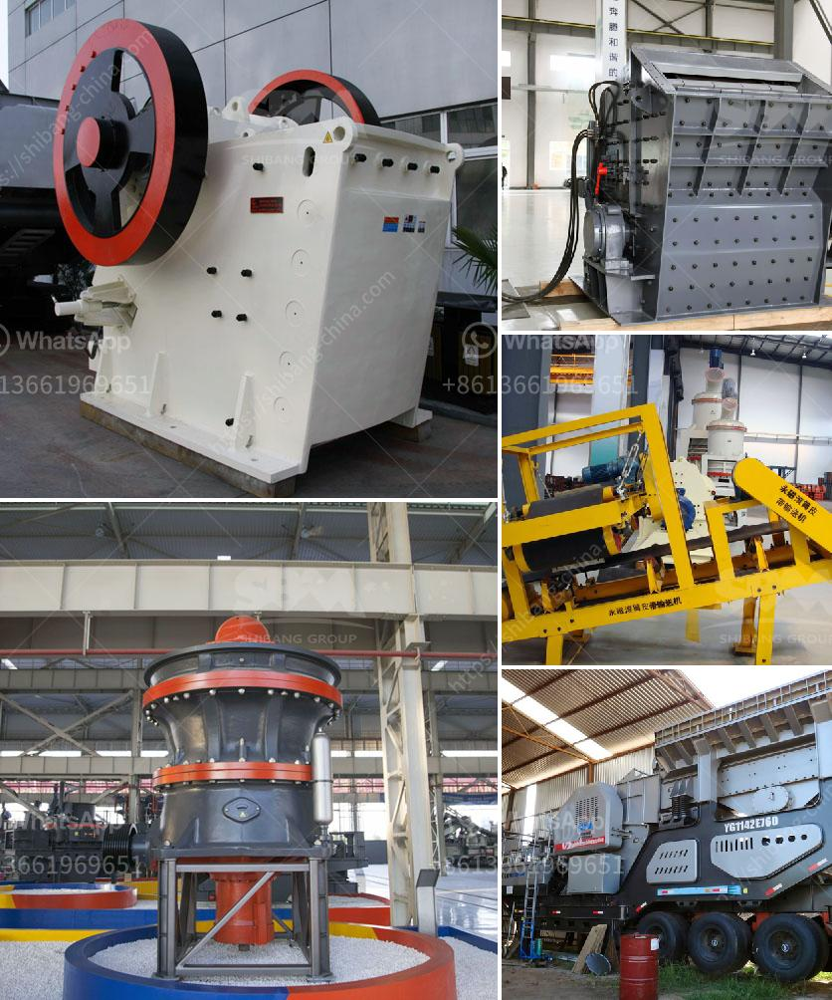

<h3>crusher pew jaw crusher</h3>
The Crusher PEW Jaw Crusher is a highly efficient and reliable crushing machine that is designed to crush materials into even sized particles. This stone crushing machine is used in a variety of industries including mining, metallurgy, building materials, highway, railway, water conservancy, and chemical industries. 

The Crusher PEW Jaw Crusher is known for its outstanding features including large crushing ratio, low energy consumption, high productivity, even size of crushed materials, simple structure, reliable operation, and easy maintenance. These features make it an ideal choice for crushing various hard and abrasive materials. 

One of the key advantages of the Crusher PEW Jaw Crusher is its advanced hydraulic system. This system allows the machine to adjust the discharge opening, making it easier to control the size of the final product. Additionally, the hydraulic system provides overload protection, preventing damage to the crusher in case of an excessive load. 

Another notable feature of the Crusher PEW Jaw Crusher is its optimized crushing chamber design. The crusher has a V-shaped cavity, which ensures that the materials are crushed more evenly and efficiently. This leads to a higher crushing ratio and a better final product shape. 

Furthermore, the Crusher PEW Jaw Crusher is equipped with high-quality bearings, ensuring smooth and reliable operation. The bearings are sealed, preventing any contamination and reducing maintenance requirements. The machine also has a rugged frame construction, which enhances its durability and reduces the risk of wear and tear. 

In summary, the Crusher PEW Jaw Crusher is a reliable and efficient crushing machine that offers superior performance. Its advanced features, including the hydraulic system, optimized crushing chamber design, and high-quality bearings, make it an excellent choice for various crushing applications. Whether you are in the mining industry, construction, or any other field requiring efficient crushing, the Crusher PEW Jaw Crusher is a trusted partner that will enhance your productivity and reliability.
<h3>Contact us</h3><ul><li><strong>Whatsapp:&nbsp;<a href="https://wa.me/8613661969651">+8613661969651</a></strong></li><li><a href="https://swt.shibang-china.com/?git&amp;zhl&amp;crusher pew jaw crusher"><strong>Online Service(chat now)</strong></a></li></ul><h3>Related</h3><ul><li><a href='objective of ball mill machine.md'>objective of ball mill machine</a></li><li><a href='granite machine concrete.md'>granite machine concrete</a></li><li><a href='price of copper ore crushing machine.md'>price of copper ore crushing machine</a></li><li><a href='conveyor belt seller in korea.md'>conveyor belt seller in korea</a></li><li><a href='conveyor belt manufacturers in kolkata.md'>conveyor belt manufacturers in kolkata</a></li></ul>