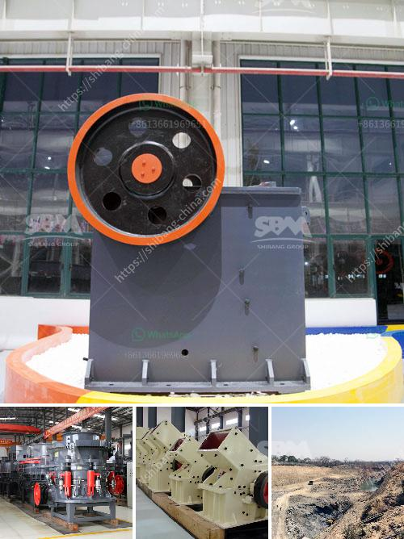

<h3>crusher plant for coal</h3>
A crusher plant for coal is a crucial piece of machinery in the mining industry. It plays a fundamental role in the processing and extraction of coal. Since coal is mined in various harsh environments, the equipment must be durable and robust to handle the challenging tasks. The crusher plant is responsible for reducing the size of coal to make it suitable for industrial use.

One of the primary components of the crusher plant is a coal conveyor. This conveyor transports the coal from the mining site to the crusher. It then passes through a series of crushers, which grind the coal into smaller sizes. After the crushing process, the coal is transported to other areas of the plant for further processing.

The crusher plant for coal is designed to have a wide range of applications. It can be used for crushing coal for power generation plants, cogeneration plants, thermal power plants, and other coal-related industries. Additionally, it is also suitable for crushing various materials such as granite, basalt, limestone, river pebble, cement clinker, quartz stone, iron ore, and bauxite.

When choosing a crusher plant for coal, it is essential to consider several factors. Firstly, the type of crusher is critical. There are different types of crushers available, such as jaw crushers, cone crushers, impact crushers, and hammer crushers. Each type serves a specific purpose and has its advantages and disadvantages. For coal processing, the primary crusher used is usually a jaw crusher, as it can handle larger coal sizes.

Another crucial factor to consider is the maximum feed size. The crusher plant's design should allow for the processing of the given coal size. It is important to have a crusher that can accommodate various coal sizes to ensure efficient and smooth operation.

The capacity of the crusher plant is also a vital factor to consider. The capacity determines the amount of coal that can be processed within a given time frame. It is important to choose a crusher plant with sufficient capacity to meet the demands of coal processing.

In addition to capacity, the efficiency of the crushing process should also be considered. A highly efficient crusher plant will help maximize productivity and reduce energy consumption. Efficiency can be measured by calculating the ratio of the output size to the input size. The higher this ratio, the more efficient the crusher plant is.

When operating a crusher plant for coal, regular maintenance is essential to ensure its optimal performance. Regular inspections and servicing of the equipment are necessary to identify and address any issues promptly. This will help prevent unexpected breakdowns and downtime, ensuring continuous coal processing.

In conclusion, a crusher plant for coal is an integral part of the mining industry. It is responsible for reducing the size of coal to make it suitable for various applications. Factors such as type, capacity, and efficiency should be considered when selecting a crusher plant for coal. Regular maintenance and servicing are essential for optimal performance. With the right crusher plant, coal can be efficiently processed and contribute to various industries' energy needs.
<h3>Contact us</h3><ul><li><strong>Whatsapp:&nbsp;<a href="https://wa.me/8613661969651">+8613661969651</a></strong></li><li><a href="https://swt.shibang-china.com/?git&amp;zhl&amp;crusher plant for coal"><strong>Online Service(chat now)</strong></a></li></ul><h3>Related</h3><ul><li><a href='stone crusher in jos plateau state nigeria.md'>stone crusher in jos plateau state nigeria</a></li><li><a href='used stone crusher plant for sale in uk.md'>used stone crusher plant for sale in uk</a></li><li><a href='thailand about stone crusher plant.md'>thailand about stone crusher plant</a></li><li><a href='modular mineral processing plant.md'>modular mineral processing plant</a></li><li><a href='stone crusher rent based mobile machine.md'>stone crusher rent based mobile machine</a></li></ul>