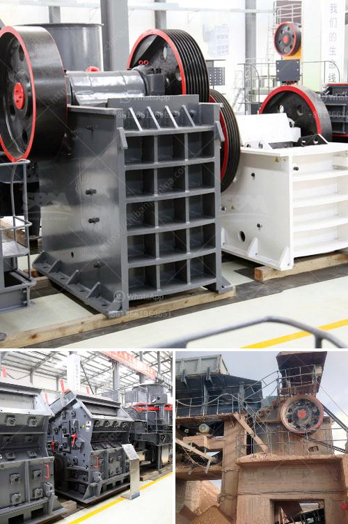

<h3>crusher plant for sale in mardan</h3>
Mardan, a beautiful city in Khyber Pakhtunkhwa, Pakistan, is known for its rich history, vibrant culture, and lush green landscapes. Over the years, the city has witnessed immense growth and development, making it an ideal place for investment opportunities. One such opportunity that has emerged in recent times is the sale of crusher plants, which have become a gateway to prosperity for both investors and the local community.

A crusher plant, also known as a stone crushing plant, is a facility where the stones are crushed into smaller pieces and used for various construction purposes. These plants are equipped with powerful crushing machines that enable them to break down even the hardest of stones into gravel, sand, or other usable materials.

The demand for crusher plants in Mardan has been on a steady rise due to the construction boom in the city and its surrounding areas. As the city grows, there is an increasing need for high-quality construction materials, such as crushed stones, to build roads, bridges, buildings, and other infrastructure projects. This surge in demand has created a lucrative market for crusher plant owners, prompting many to invest in this business.

Investing in a crusher plant in Mardan offers numerous benefits for aspiring entrepreneurs. Firstly, the city's strategic location, being well-connected to major transportation routes, ensures easy access to raw materials and enables the efficient distribution of finished products. This reduces costs and helps businesses become more competitive in the market.

Furthermore, the sale of crusher plants generates employment opportunities for the local community. These plants require a skilled workforce to operate and maintain them, providing jobs to technicians, machine operators, drivers, and other support staff. This, in turn, helps to alleviate unemployment and promote economic growth in the area.

In addition to the economic benefits, crusher plants also contribute to the development of local infrastructure. As more roads and buildings are constructed using the crushed stones produced by these plants, the overall infrastructure of the city improves, making it more accessible and attractive for potential investors and tourists.

Another noteworthy advantage of investing in a crusher plant in Mardan is the potential for long-term profitability. With the increasing demand for construction materials, there is a constant need for crushed stones. By establishing a well-managed crusher plant, entrepreneurs can secure a continuous stream of income, ensuring a stable financial future.

Nevertheless, it is essential to approach this business venture with careful planning and rigorous market analysis. Conducting a feasibility study, assessing demand and competition, and understanding the legal and regulatory requirements are critical steps to ensure success in this industry.

In conclusion, the sale of crusher plants in Mardan is an attractive investment opportunity for both entrepreneurs and the local community. With the city's booming construction sector and its strategic location, setting up a crusher plant can pave the way for prosperity and economic growth. Aspiring investors should seize this opportunity and contribute to the development of Mardan while enjoying the long-term benefits of this promising business venture.
<h3>Contact us</h3><ul><li><strong>Whatsapp:&nbsp;<a href="https://wa.me/8613661969651">+8613661969651</a></strong></li><li><a href="https://swt.shibang-china.com/?git&amp;zhl&amp;crusher plant for sale in mardan"><strong>Online Service(chat now)</strong></a></li></ul><h3>Related</h3><ul><li><a href='mineral grinding corporation.md'>mineral grinding corporation</a></li><li><a href='cement mill startup procedures.md'>cement mill startup procedures</a></li><li><a href='jaw crusher seller in pakistan.md'>jaw crusher seller in pakistan</a></li><li><a href='sample quarry business plan.md'>sample quarry business plan</a></li><li><a href='portable gold ore crusher.md'>portable gold ore crusher</a></li></ul>