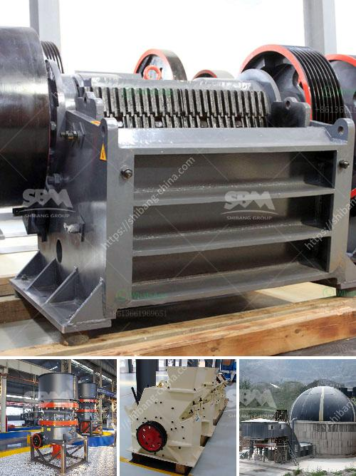

<h3>crusher plant for sale in texas</h3>
Gravel is an indispensable material for construction projects. While many people associate gravel with residential driveways, it is crucial for various other uses. Commercial buildings, highways, and even airports require gravel for their construction. In order to meet the high demand for this essential material, crusher plants are strategically located all across Texas.

A crusher plant, also known as a crushing plant, is an industrial machine designed to crush rocks and other hard materials into smaller pieces. Depending on the type of crusher plant, materials like gravel, sand, or rocks can be put into different applications. Depending on the size and processing capacity of the crusher plant, it can be used to create base material, screening fill, or even concrete and asphalt aggregate.

One of the key benefits of having a crusher plant for sale in Texas is its ability to produce aggregate materials of different sizes and specifications. Unlike natural deposits, crusher plants can crush rocks and break them down into smaller particles of various sizes, ensuring that the material meets the specific requirements of a project. This flexibility is crucial in construction as it allows builders to match the material specifications to different stages of the project.

Another advantage of having a crusher plant for sale in Texas is the cost-effectiveness it offers. By having an on-site crusher plant, construction companies can significantly reduce transportation costs as they no longer need to rely solely on external suppliers for their gravel needs. Additionally, by producing their own aggregate materials, construction companies can have greater control over the quality, quantity, and availability of the material they require, leading to improved project efficiency and timeline adherence.

In Texas, where the demand for gravel is high due to the booming construction industry, having a crusher plant for sale offers tremendous business opportunities. Construction companies can benefit from increased profit margins by supplying their own aggregate materials and reducing their reliance on external suppliers. Furthermore, the demand for gravel in Texas is likely to remain consistently high, meaning that a crusher plant investment promises long-term returns.

There are several factors to consider when purchasing a crusher plant in Texas. Firstly, it is important to assess the processing capacity and crushing efficiency of the plant to ensure it meets the anticipated demand. The quality, reliability, and durability of the machinery are also crucial to minimizing downtime and maximizing productivity.

Additionally, it is important to comply with local regulations and obtain the necessary permits to operate a crusher plant. Texas has specific regulations regarding air pollution control and site reclamation, and it is important to adhere to these guidelines to ensure sustainable and responsible operations.

In conclusion, a crusher plant for sale in Texas offers numerous benefits for construction companies. Not only does it provide a cost-effective solution for gravel requirements, but it also offers increased control over material specifications and availability. With the booming construction industry in Texas, investing in a crusher plant is a strategic move that promises long-term profitability and business growth.
<h3>Contact us</h3><ul><li><strong>Whatsapp:&nbsp;<a href="https://wa.me/8613661969651">+8613661969651</a></strong></li><li><a href="https://swt.shibang-china.com/?git&amp;zhl&amp;crusher plant for sale in texas"><strong>Online Service(chat now)</strong></a></li></ul><h3>Related</h3><ul><li><a href='japan crusher equipment.md'>japan crusher equipment</a></li><li><a href='jaw crushers sale.md'>jaw crushers sale</a></li><li><a href='ball mill heat balance.md'>ball mill heat balance</a></li><li><a href='basin a grinding roller mill.md'>basin a grinding roller mill</a></li><li><a href='crusher supplier in saudi arabia.md'>crusher supplier in saudi arabia</a></li></ul>