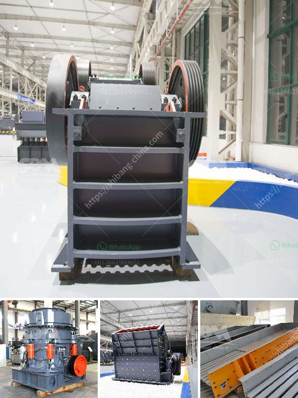

<h3>crusher plant in construction</h3>
A crusher plant is a machine designed to reduce the size of large rocks and gravel. These machines are often used to process raw materials into smaller pieces for the construction industry or other industries. In recent years, crusher plants have become an essential tool for many construction projects, generating high-quality aggregates to be used in various applications.

One of the main advantages of a crusher plant is its ability to produce a wide range of materials. By adjusting the settings of the crusher, operators can create aggregates of different sizes and specifications. This versatility allows contractors to meet the demands of different projects, from road construction to building foundations. Moreover, crusher plants can also produce sand and other fine materials, which are essential for the production of concrete and mortar.

The process of crushing raw materials typically involves several stages. First, the raw materials are fed into the primary crusher, which reduces their size to a manageable level. The crushed materials are then transported to a secondary crusher, where further reduction takes place. Finally, the crushed materials are screened to separate them into different sizes.

One of the key components of a crusher plant is the vibrating feeder. This device ensures a continuous and controlled flow of raw materials into the crusher. It prevents oversize materials from entering the crusher, which could cause damage. The vibrating feeder also helps to ensure that the crusher operates at its maximum efficiency by evenly distributing the material across the crushing chamber.

Another important component of a crusher plant is the conveyor belt system. This system moves the crushed materials from one stage to another, allowing for a seamless production process. The conveyor belt system also helps to reduce manpower and increase efficiency in the construction site.

In addition to these components, crusher plants may also include a control panel and a generator. The control panel allows operators to adjust the settings of the crusher and monitor its performance. It provides valuable information about the crusher's operation, such as the amount of material being processed and the energy consumption. The generator provides the necessary power for the crusher plant to function, making it independent of the main power supply.

In conclusion, a crusher plant is an essential tool for the construction industry. It allows contractors to produce high-quality aggregates of different sizes and specifications, which are used in various applications. Crusher plants are versatile machines that can process a wide range of raw materials, including rocks, gravel, and sand. They consist of various components, such as a primary crusher, a secondary crusher, a vibrating feeder, a conveyor belt system, a control panel, and a generator. These components work together to ensure a smooth and efficient production process. With the help of a crusher plant, construction projects can be completed with greater ease and efficiency.
<h3>Contact us</h3><ul><li><strong>Whatsapp:&nbsp;<a href="https://wa.me/8613661969651">+8613661969651</a></strong></li><li><a href="https://swt.shibang-china.com/?git&amp;zhl&amp;crusher plant in construction"><strong>Online Service(chat now)</strong></a></li></ul><h3>Related</h3><ul><li><a href='gold mining mills in south africa.md'>gold mining mills in south africa</a></li><li><a href='business plan for small mining processing plant.md'>business plan for small mining processing plant</a></li><li><a href='rock pulverizer crusher technologies.md'>rock pulverizer crusher technologies</a></li><li><a href='rock hammer mill for sale.md'>rock hammer mill for sale</a></li><li><a href='how to build a stone crusher.md'>how to build a stone crusher</a></li></ul>