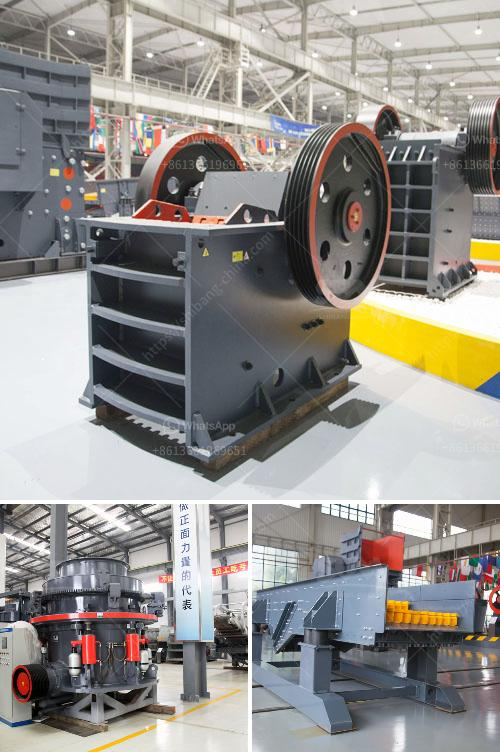

<h3>crusher plant in india</h3>
Crusher plant in India is one of the key players in the construction and mining industry. It is designed to crush stones of different types and sizes to produce aggregate for various purposes. Crushing plants have a wide range of applications and they are particularly suitable for crushing hard rocks such as basalt and granite.

The crusher plant in India consists of a primary jaw crusher followed by a cone crusher and a vertical shaft impactor (VSI), both feeding into a triple-deck vibrating screen. The plant also includes conveyors, and in some cases, a washing system, which is necessary to produce the desired aggregate used for road construction, concrete, and asphalt production.

One of the key advantages of a crusher plant is its versatility. It can be easily relocated to any site, which saves time and money. This is especially beneficial for contractors who need to move their equipment frequently between construction sites. Additionally, the plant can produce different types of aggregates by adjusting the settings of the crushers and screens, making it a flexible solution for various projects.

Crusher plants in India are essential for the construction industry, as they produce the base materials required for road construction, bridge construction, and railway projects. With the increasing demand for aggregates, it is more important than ever to ensure that the crusher plant meets the highest quality standards for the production of aggregates suitable for these purposes.

To ensure the quality of the aggregates produced, regular maintenance and inspection of the crusher plant are necessary. This includes checking the crushers for wear and tear, as well as inspecting the screens, conveyors, and other equipment for any potential issues. Additionally, regular cleaning and lubrication of the machinery is important to maintain optimal performance and prolong the lifespan of the plant.

There are several crusher plant manufacturers in India, who provide comprehensive solutions for the construction and mining industry. Some of the well-known manufacturers include Metso, Puzzolana, and Propel. These manufacturers have a wide range of crusher plants that are ideally suited for the Indian market.

In conclusion, crusher plants in India are essential for the construction industry and can significantly contribute to the overall growth and development of the country. With the ever-increasing demand for aggregates, it is important to have well-designed and efficient crusher plants that can produce high-quality aggregates for various construction purposes. Regular maintenance and inspection of the crusher plant are crucial to ensure its optimal performance and longevity. Overall, the crusher plant industry in India holds immense potential for growth and plays a significant role in infrastructure development.
<h3>Contact us</h3><ul><li><strong>Whatsapp:&nbsp;<a href="https://wa.me/8613661969651">+8613661969651</a></strong></li><li><a href="https://swt.shibang-china.com/?git&amp;zhl&amp;crusher plant in india"><strong>Online Service(chat now)</strong></a></li></ul><h3>Related</h3><ul><li><a href='cheap used jaw rock crushers for sale.md'>cheap used jaw rock crushers for sale</a></li><li><a href='sand crushing machine.md'>sand crushing machine</a></li><li><a href='dust cover for screening and crushing plant.md'>dust cover for screening and crushing plant</a></li><li><a href='charcoal crusher kenya.md'>charcoal crusher kenya</a></li><li><a href='crusher machine making in pakistan.md'>crusher machine making in pakistan</a></li></ul>