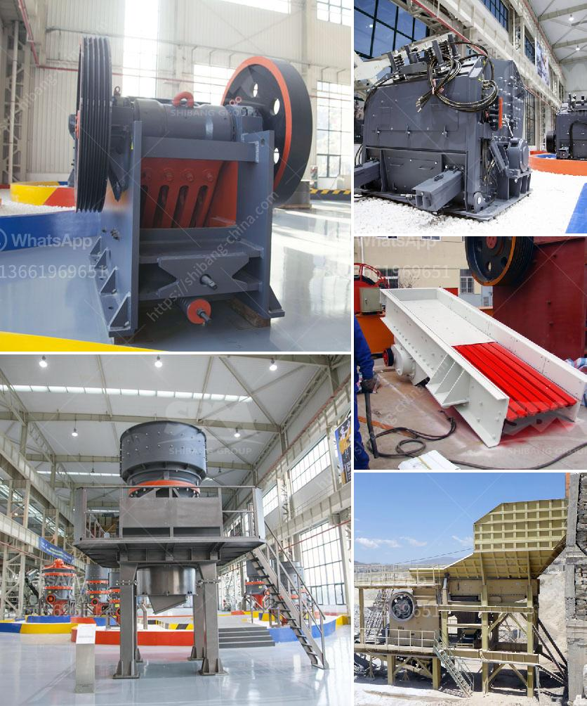

<h3>crusher plant made in pakistan price</h3>
The crusher plants in Pakistan are becoming a significant resource for the nation’s construction industry. This recent investment in the country's infrastructure by the private sector has created a vital market for manufacturers and suppliers offering crushing machinery, as well as screening and washing equipment. The increasing number of crusher plants in Pakistan has raised the question of their prices. What is the price of these new crusher plants?

As we all know, the construction industry in Pakistan is growing rapidly. This sector has grown at a remarkable rate of 7.7% per annum over the past few years. The government has also taken several initiatives to boost the construction sector, such as the construction-related tax reforms and the initiation of the Construction Industry Development Board (CIDB). All these factors have encouraged investors to establish crusher plants in different parts of the country.

Crusher plants, also known as stone crushing and screening plants, are facilities that can process rocks into various products. They are often used to create construction material for buildings, roads, bridges, and other infrastructure projects. The primary purpose of these plants is to reduce the size of the rocks or stone and make them suitable for further processing.

The prices of crusher plants in Pakistan vary depending on the model, size, and capacity. However, the large-scale project investment in the country has increased the demand for construction equipment, which in turn has increased the price of crusher plants. Some of the leading manufacturers in Pakistan provide quality products and deliver exceptional after-sales service to their clients. These manufacturers offer a wide range of crusher plants with different specifications at competitive prices.

Investing in a crusher plant is a wise choice for both new entrants and established players in the construction industry. One of the major advantages of these plants is that they provide a ready supply of materials required for the construction process. With the availability of a reliable and high-quality crusher plant, contractors and builders can complete their projects efficiently and within the scheduled time frame.

Additionally, the establishment of crusher plants in various parts of the country has created job opportunities for the local workforce. These plants require skilled and semi-skilled labor to operate and maintain their machinery. This has not only resulted in reduced unemployment rates but has also contributed to the overall economic growth of the country.

Moreover, crusher plants made in Pakistan have also contributed towards foreign investment in the country. Many multinational companies have either set up their production units or entered into partnerships with local manufacturers to meet the rising demand for construction equipment and related components. This has not only resulted in an inflow of foreign capital but has also enhanced the transfer of technology and technical expertise in the construction industry.

In conclusion, the crusher plants made in Pakistan price should be explored by contractors, builders, and developers for their construction projects. At present, the market has become more competitive after the entry of numerous companies offering crusher plants. As a result, the prices of these plants have gone down drastically, making it a lucrative investment opportunity for buyers. The demand for crusher plants in Pakistan is increasing due to the growth of the construction industry and the initiatives taken by the government to promote infrastructure development. With the right investment, both the economy and the construction industry in Pakistan can be revitalized.
<h3>Contact us</h3><ul><li><strong>Whatsapp:&nbsp;<a href="https://wa.me/8613661969651">+8613661969651</a></strong></li><li><a href="https://swt.shibang-china.com/?git&amp;zhl&amp;crusher plant made in pakistan price"><strong>Online Service(chat now)</strong></a></li></ul><h3>Related</h3><ul><li><a href='small concrete crusher for sale.md'>small concrete crusher for sale</a></li><li><a href='gold processing equipment.md'>gold processing equipment</a></li><li><a href='stone crusher rent based mobile machine.md'>stone crusher rent based mobile machine</a></li><li><a href='ball grinding mill buy.md'>ball grinding mill buy</a></li><li><a href='cement plants capacities of lafarge in nigeria.md'>cement plants capacities of lafarge in nigeria</a></li></ul>