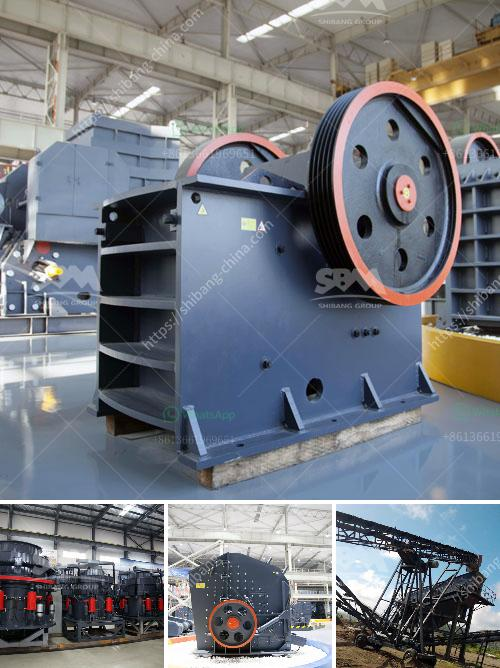

<h3>crusher plant manufacturers in south africa</h3>
Crusher plant manufacturers in South Africa are producing various kinds of crushing and screening plants which includes small crushing plants, medium crushing plants, large crushing plants, stationary crushing plants, etc. The capacity of these plants is ranging from 50 TPH to 1000 TPH. It is essential to select the proper equipment, which can be identified based on the requirement of the mine owners.

Crusher plants are designed according to type of material to be crushed, its sizes and hardness level. In addition to these factors, the whole processing plant needs to be considered as well. The initial investment costs for stone crushing plants is relatively high. Importance of Crusher Plant Manufacturers Across the world, crushing and grinding plants are extensively used for reducing the size of extracted rocks or ores.

Crushing plants are the huge assembly of machines designed to recycle and reprocess the rubbles of buildings, roads, or other materials into commercially sized aggregate for use as base material or another value-added applications. Crusher plants also known as “stone crushing and screening plants.” These facilities break large rock fragments and bring them to the desired calibration. The purpose of this process is to prepare the ore material for sorting or further crushing by primary crushers.

Crushing plants may be either fixed or mobile. A crushing plant has different stations, such as primary, secondary, tertiary, where different crushing, selection, and transport cycles are done to obtain different stone sizes, and the needed furnace for extracting different metals. These facilities can be stationary or mobile units. User is Active NowÀ
<h3>Contact us</h3><ul><li><strong>Whatsapp:&nbsp;<a href="https://wa.me/8613661969651">+8613661969651</a></strong></li><li><a href="https://swt.shibang-china.com/?git&amp;zhl&amp;crusher plant manufacturers in south africa"><strong>Online Service(chat now)</strong></a></li></ul><h3>Related</h3><ul><li><a href='cost to setup cement plant industry.md'>cost to setup cement plant industry</a></li><li><a href='thailand about stone crusher plant.md'>thailand about stone crusher plant</a></li><li><a href='grinding and mixing machine for quartz.md'>grinding and mixing machine for quartz</a></li><li><a href='ball mill design calculation.md'>ball mill design calculation</a></li><li><a href='limestone jaw crushers.md'>limestone jaw crushers</a></li></ul>