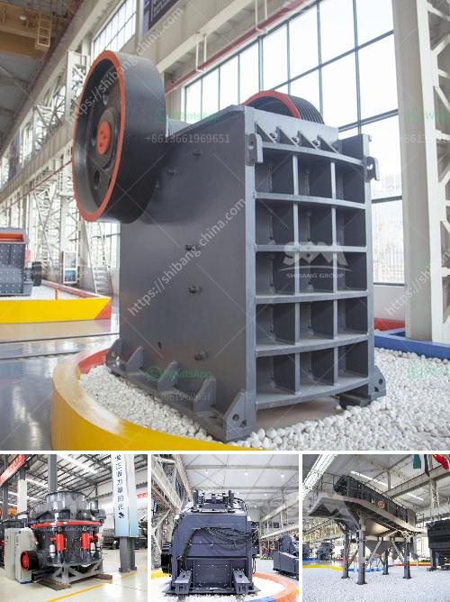

<h3>crusher plant power screen</h3>
A crusher plant is a machine designed to reduce the size of materials or rock into smaller pieces. It is used for various types of industrial materials such as limestone, granite, gypsum, trona, shale, bauxite, oil shale, coke, salt, lime, glass, kaolin, brick, shale, and wet, sticky feeds.

One of the popular crusher plants is the power screen crusher plant. Power screen is a well-known name in the mining and construction industry for its high-quality and reliable equipment. It comes with a variety of screen sizes, making it suitable for various applications.

The power screen crusher plant consists of a range of crushers, including jaw, impact, and cone crushers. With a powerful drive system, it ensures an efficient screening process for the materials. In addition to crushers, the plant also includes a vibrating screen deck, conveyor belts, and a generator.

The power screen crusher plant is known for its high production capacity. It can crush large volumes of materials in a short span of time, making it highly efficient. This makes it ideal for large construction projects or mining operations where a significant amount of material needs to be processed.

One of the key features of the power screen crusher plant is its mobility. It can be easily transported from one location to another, allowing operators to set up temporary crushing operations at different sites. This flexibility is particularly useful in construction sites where materials need to be crushed on-site.

The power screen crusher plant is also designed with the operator's comfort and safety in mind. It features a user-friendly control panel that allows operators to monitor and control the entire crushing process easily. The plant is also equipped with safety measures such as emergency stop buttons and warning sirens to ensure that operators can respond quickly to any unforeseen situations.

Furthermore, the power screen crusher plant is designed to be environmentally friendly. It is equipped with a dust suppression system that reduces dust emissions during the crushing process, making it less harmful to the environment and the workers' health.

In conclusion, the power screen crusher plant is a versatile and efficient machine that is widely used in the mining and construction industry. With its high production capacity, mobility, and user-friendly design, it ensures a smooth and efficient crushing process. The plant is also environmentally friendly, with dust suppression systems to minimize dust emissions. If you are looking for a reliable and efficient crusher plant, the power screen crusher plant is worth considering.
<h3>Contact us</h3><ul><li><strong>Whatsapp:&nbsp;<a href="https://wa.me/8613661969651">+8613661969651</a></strong></li><li><a href="https://swt.shibang-china.com/?git&amp;zhl&amp;crusher plant power screen"><strong>Online Service(chat now)</strong></a></li></ul><h3>Related</h3><ul><li><a href='cost of graphite beneficiation plant.md'>cost of graphite beneficiation plant</a></li><li><a href='small concrete crusher for sale.md'>small concrete crusher for sale</a></li><li><a href='big crusher stones east london south africa.md'>big crusher stones east london south africa</a></li><li><a href='iron jaw crusher with output of mm.md'>iron jaw crusher with output of mm</a></li><li><a href='ball mill for silica grinding made in japan.md'>ball mill for silica grinding made in japan</a></li></ul>