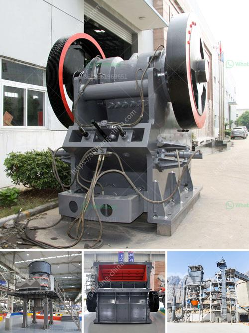

<h3>crusher plant price</h3>
When buying a crusher plant, it is important to consider several factors before making any decision. One of the most crucial factors is the price of the plant. Finding the right price for your crusher plant is essential because it directly affects your budget and the overall profitability of your project. In this article, we will discuss the importance of considering crusher plant price and how it can impact your business.

First and foremost, the price of a crusher plant will depend on its capacity, features, and brand. Different plants have different capacities and come with various features, such as crushing, screening, and conveying equipment. The more advanced and high-capacity plants will generally have a higher price tag. However, it is crucial to find a balance between your budget and the plant's capacity to meet your project requirements efficiently.

Secondly, the price of a crusher plant also depends on its brand reputation. Well-established brands often come with higher prices due to their reliability and durability. While investing in a renowned brand may seem expensive initially, it can save you money in the long run as the plant will require fewer repairs and maintenance, resulting in less downtime. Cheaper plants from lesser-known brands may seem like a tempting option, but they often lack the necessary quality and after-sales support.

Additionally, it is important to consider the operational cost of running the crusher plant. Some plants are more fuel-efficient and consume less energy, resulting in lower operational costs. These factors should be taken into account when comparing different crusher plant prices.

Moreover, it is crucial to consider the lifespan of the crusher plant. A well-built and durable plant may have a higher price tag initially, but it can significantly reduce your costs in the long run by avoiding frequent breakdowns and replacements. On the other hand, a cheaper plant may have a shorter lifespan and require more frequent repairs or replacements, leading to additional costs.

Furthermore, it's essential to evaluate the after-sales services offered by manufacturers or suppliers. A good warranty and reliable customer support can provide peace of mind and save you money in case of any issues or repairs required for your crusher plant. Therefore, it is crucial to research and choose a supplier with a reputation for excellent after-sales services.

To find the best crusher plant price, it is recommended to obtain quotes from multiple suppliers and compare the prices, features, and after-sales services they offer. Don't make your decision solely based on the price; consider the overall value for your investment. Additionally, take into account your project requirements, including capacity, available space, and specific needs. By carefully evaluating all these factors, you can make an informed decision that suits your budget and ensures optimal performance of your crusher plant.

In conclusion, the price of a crusher plant is a critical factor to consider when making a purchase. It directly affects your budget, operational costs, and overall profitability. Investing in a high-quality, reliable plant from a reputable brand might initially seem expensive, but it can pay off in the long run through reduced downtime and lower maintenance costs. Comparing quotes and evaluating the overall value offered by different suppliers will help you find the right crusher plant price for your specific project requirements.
<h3>Contact us</h3><ul><li><strong>Whatsapp:&nbsp;<a href="https://wa.me/8613661969651">+8613661969651</a></strong></li><li><a href="https://swt.shibang-china.com/?git&amp;zhl&amp;crusher plant price"><strong>Online Service(chat now)</strong></a></li></ul><h3>Related</h3><ul><li><a href='small mobile diesel engine double rolls crusher.md'>small mobile diesel engine double rolls crusher</a></li><li><a href='mobile crushing price uk.md'>mobile crushing price uk</a></li><li><a href='prices of copper smelting plant.md'>prices of copper smelting plant</a></li><li><a href='types of ball mills.md'>types of ball mills</a></li><li><a href='hammer grinding machine philippines.md'>hammer grinding machine philippines</a></li></ul>