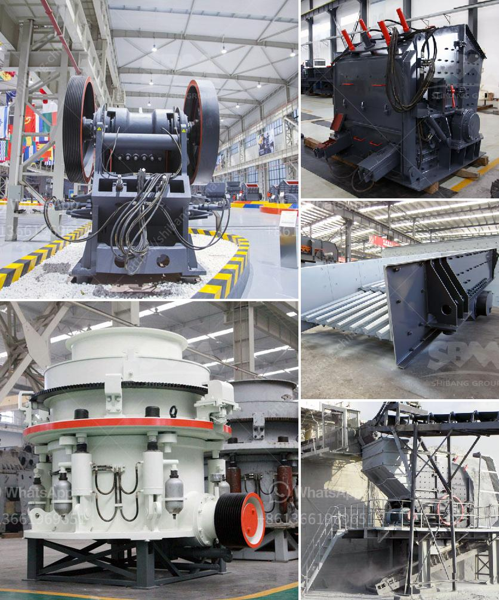

<h3>crusher plants for sale in pakistan</h3>
Crusher plants are widely used in the mining industry for various purposes. These plants are specifically designed to break down the rocks into smaller pieces for further processing in various industries. So, if you are planning to buy a crusher plant in Pakistan, it is vital to choose a reliable and efficient one.

There are several factors that need to be considered before purchasing a crusher plant. Firstly, you need to determine the type of material you will be processing. Different crusher plants are designed to process different types of rocks and minerals. So, it is crucial to choose a plant that is suitable for the specific material you will be working with to ensure maximum efficiency.

Secondly, the size and capacity of the crusher plant should be considered. The size and capacity will depend on the amount of material you will be processing, as well as the desired output size. It is important to choose a plant that can handle the volume of material you intend to process while producing the desired output size.

Another important factor to consider is the power source of the crusher plant. In Pakistan, electricity availability might be an issue in certain areas. Therefore, it is essential to choose a plant that can operate efficiently on the local power supply or has alternative power options available.

Maintenance and after-sales support also play a significant role in the decision-making process when buying a crusher plant. It is essential to choose a plant that is easy to maintain and has readily available spare parts. Additionally, ensure that there is proper after-sales support from the manufacturer or supplier to address any issues that might arise during the plant's operation.

Furthermore, it is highly recommended to do thorough research on different manufacturers and suppliers before making a final decision. Look for reputable and experienced companies that have a track record of providing high-quality crusher plants. Read customer reviews and ratings to get a better understanding of their product quality and customer service.

Once you have identified a reliable supplier, it is advisable to visit their facility or request a virtual tour to see the crusher plants in operation. This will give you an opportunity to assess the overall quality, efficiency, and durability of their plants.

In conclusion, crusher plants are indispensable in the mining industry, and if you are planning to buy one in Pakistan, it is crucial to choose a reliable and efficient plant. Consider factors such as the type of material, size, capacity, power source, and maintenance requirements before making a decision. Do thorough research on different manufacturers and suppliers to ensure you are getting a high-quality product. By doing so, you can ensure the smooth operation of your crusher plant and maximize your productivity.
<h3>Contact us</h3><ul><li><strong>Whatsapp:&nbsp;<a href="https://wa.me/8613661969651">+8613661969651</a></strong></li><li><a href="https://swt.shibang-china.com/?git&amp;zhl&amp;crusher plants for sale in pakistan"><strong>Online Service(chat now)</strong></a></li></ul><h3>Related</h3><ul><li><a href='quarry crusher for sale.md'>quarry crusher for sale</a></li><li><a href='products lm vertical grinding mills.md'>products lm vertical grinding mills</a></li><li><a href='sand wash plant 50tph.md'>sand wash plant 50tph</a></li><li><a href='mill for gold mining operation.md'>mill for gold mining operation</a></li><li><a href='calcite processing machine.md'>calcite processing machine</a></li></ul>