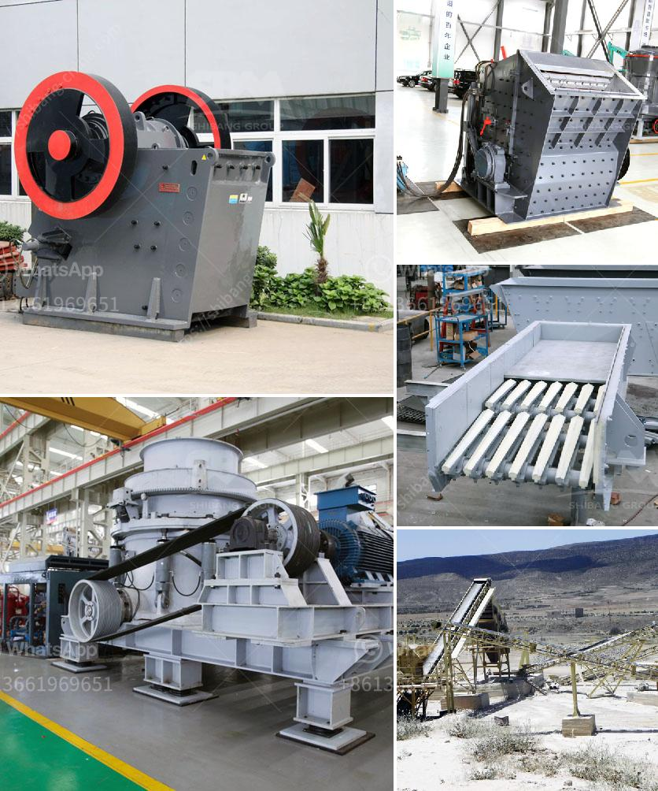

<h3>crusher plants for sale</h3>
Crusher plants are designed to break stones into smaller pieces, making them suitable for a variety of applications in industries such as construction, mining, and recycling. These plants are highly efficient and come in different sizes and capacity levels to suit the needs of various businesses. If you are in the market for a crusher plant, now is a great time to invest. With advancements in technology and increasing demand for construction materials, crusher plants for sale offer a lucrative opportunity for expansion and growth.

One of the primary advantages of crusher plants is their ability to process a wide range of materials. From hard rocks to soft stones, these plants are designed to handle different types of aggregates efficiently. This versatility makes them ideal for projects of all sizes, ensuring high performance even in the most demanding applications.

In addition, crusher plants are highly mobile, allowing businesses to move them to different locations as needed. This mobility not only ensures efficient utilization of the equipment but also offers flexibility in site selection. Being able to move the crusher plant to a construction site reduces the transportation cost of aggregates, making it an economical choice for businesses.

Crusher plants for sale also contribute to environmental sustainability by promoting recycling. These plants can process concrete and asphalt debris, turning them into usable materials for new construction projects. Recycling not only reduces landfill waste but also conserves natural resources, making it an eco-friendly choice for businesses looking to minimize their carbon footprint.

Another factor that makes crusher plants an attractive investment is the increasing demand for construction materials. As urbanization and infrastructure development continue to progress worldwide, the need for aggregates, such as sand, gravel, and crushed stones, is on the rise. This growing demand ensures a steady market for crusher plant owners, making it a profitable venture in the long run.

When considering crusher plants for sale, it is essential to evaluate the reputation and reliability of the manufacturer or supplier. Look for a company with a track record in designing and producing high-quality and durable crusher plants. They should also offer comprehensive customer support, including installation, training, and after-sales service.

It is also important to determine the capacity and specifications that match your business requirements. Some crusher plants are designed for small-scale operations, while others are more suitable for large-scale projects. Assess your production needs and future growth plans to select the right size and capacity level for your crusher plant.

In conclusion, crusher plants for sale present a great investment opportunity for businesses in the construction, mining, and recycling industries. These plants offer versatility, mobility, and sustainability, making them an ideal choice for various applications. With the increasing demand for construction materials and advancements in technology, investing in crusher plants can lead to long-term profitability and growth. Research reputable manufacturers, evaluate your business needs, and take advantage of this opportune moment to expand your operations with a crusher plant.
<h3>Contact us</h3><ul><li><strong>Whatsapp:&nbsp;<a href="https://wa.me/8613661969651">+8613661969651</a></strong></li><li><a href="https://swt.shibang-china.com/?git&amp;zhl&amp;crusher plants for sale"><strong>Online Service(chat now)</strong></a></li></ul><h3>Related</h3><ul><li><a href='cone crusher for sale in ghana.md'>cone crusher for sale in ghana</a></li><li><a href='machinery crushing machine.md'>machinery crushing machine</a></li><li><a href='grinding machinery manufecture in africa.md'>grinding machinery manufecture in africa</a></li><li><a href='how to pulverized limestone crusher.md'>how to pulverized limestone crusher</a></li><li><a href='500 ton hour coal crusher and screen.md'>500 ton hour coal crusher and screen</a></li></ul>