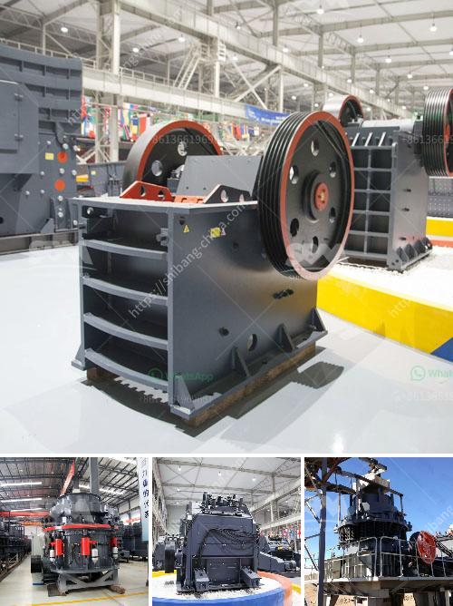

<h3>crusher stone price south africa</h3>
Crusher stone price in South Africa is usually affected by factors such as crushed stone production history, market demand, and the level of competition. These factors provide an analysis of price fluctuation in the market and a clear overview of how the stone market has evolved over time.

Crusher stones are essential for different construction activities, particularly in areas where building projects are in progress. Stones are used in the construction of roads, highways, and other infrastructural development projects. They are also commonly used to create foundations for buildings, as well as for landscaping and decoration purposes.

One of the primary factors affecting the price of crusher stones in South Africa is the transportation costs. Transport costs vary greatly depending on the distance between the quarry and the construction site. This significantly affects the overall cost of the stone and, in turn, influences the final selling price.

Another important aspect to consider when understanding the prices of crusher stones in South Africa is market demand. As with any commodity, when demand is high, prices tend to increase. Conversely, when demand is low, prices may decrease. The overall economic climate of the country can also impact market demand for construction materials, including crusher stones.

Competition among stone quarries is another factor that determines the price of crusher stones. South Africa has numerous stone quarries across the country, and the competition among them plays a significant role in determining the final price. Quarry owners are constantly striving to provide the best quality stones at the most affordable prices to attract more customers.

The quality of crusher stones also impacts their price. Stones that are durable, resistant to wear and tear, and have a longer lifespan tend to be priced higher due to their superior quality. The hardness and composition of the stone also affect its price, as certain types of stones are more difficult to extract and require specialized equipment, driving up production costs.

The pricing of crusher stones in South Africa can also be influenced by the global market. International trends, such as changes in the cost of raw materials or fluctuations in the exchange rate, can have a direct impact on the price of crusher stones. South Africa imports a significant amount of construction materials, and any changes in the international market can affect the final price of these materials.

In conclusion, crusher stone prices in South Africa are subject to various factors, including transportation costs, market demand, competition, stone quality, and global market trends. Understanding these factors is crucial for buyers and sellers to make informed decisions. By considering these influencing factors, individuals can navigate the market effectively and obtain the most reasonable prices for crusher stones in South Africa.
<h3>Contact us</h3><ul><li><strong>Whatsapp:&nbsp;<a href="https://wa.me/8613661969651">+8613661969651</a></strong></li><li><a href="https://swt.shibang-china.com/?git&amp;zhl&amp;crusher stone price south africa"><strong>Online Service(chat now)</strong></a></li></ul><h3>Related</h3><ul><li><a href='basalt production plant.md'>basalt production plant</a></li><li><a href='5hp industrial crusher mill.md'>5hp industrial crusher mill</a></li><li><a href='manufacturer of ultrafine machine india.md'>manufacturer of ultrafine machine india</a></li><li><a href='gravel crushers in saskatchewan for sale.md'>gravel crushers in saskatchewan for sale</a></li><li><a href='used mobile crusher in nigeria.md'>used mobile crusher in nigeria</a></li></ul>