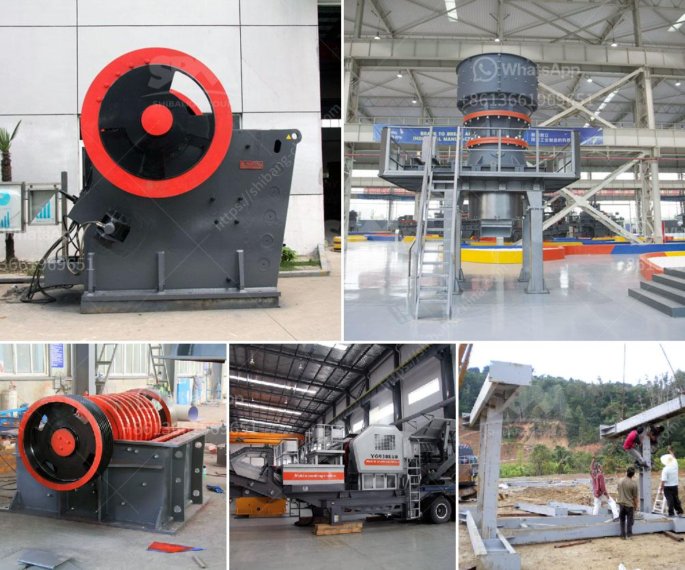

<h3>crusher stone prices</h3>
Crusher stone, also known as crushed stone, is an aggregate produced from crushed rocks, natural or manufactured stones, and sometimes recycled materials. It is an essential component in various construction projects, including buildings, highways, pavements, bridges, and drainage systems.

When it comes to crusher stone prices, they can vary significantly depending on several factors. These factors include the type and grade of the stone, the size and quantity purchased, transportation costs, market demand, and the location of the supplier. In this article, we will explore these factors and provide a general overview of crusher stone prices.

One crucial factor that affects crusher stone prices is the type and grade of the stone. Different stones have varying characteristics, such as hardness, durability, and color, which can influence their demand and pricing. Generally, harder and more durable stones, such as granite and basalt, tend to be more expensive compared to softer stones like limestone and sandstone.

The size and quantity of crusher stone purchased also play a role in determining prices. Typically, larger stones or those with a higher quantity required will have a higher price per ton. This is because the extraction and processing cost per unit weight increase as the stone size or quantity increases.

Transportation costs are another significant factor affecting crusher stone prices. The distance between the supplier and the project site, as well as the mode of transportation used, can greatly impact the final cost. Supplier locations closer to the project site may offer lower transportation costs, resulting in more competitive prices. Additionally, large construction projects often require bulk deliveries, which can sometimes lead to discounted prices due to economies of scale.

Market demand is a crucial aspect that influences the pricing of crusher stone. During periods of high demand, such as the construction peak seasons, prices tend to be higher due to increased competition and limited supply. On the other hand, during periods of low demand or economic downturns, prices may decrease as suppliers try to attract customers and maintain sales volume.

Lastly, the location of the supplier can influence crusher stone prices. Suppliers located in more remote areas may have higher operating costs, including transportation, labor, and equipment maintenance. Consequently, these suppliers may charge higher prices to cover these additional expenses. In contrast, suppliers located near major cities or transportation hubs tend to have lower operational costs, resulting in more competitive prices.

While this article provides a general overview of factors influencing crusher stone prices, it is essential to note that prices can vary significantly from one supplier to another. Therefore, it is always advisable to request quotes from multiple suppliers and compare their prices, ensuring you get the best value for your money.

In conclusion, crusher stone prices can vary depending on factors such as the type and grade of the stone, the size and quantity purchased, transportation costs, market demand, and supplier location. Understanding these factors and obtaining multiple quotes from different suppliers will enable you to make informed decisions and find the most cost-effective solution for your construction project.
<h3>Contact us</h3><ul><li><strong>Whatsapp:&nbsp;<a href="https://wa.me/8613661969651">+8613661969651</a></strong></li><li><a href="https://swt.shibang-china.com/?git&amp;zhl&amp;crusher stone prices"><strong>Online Service(chat now)</strong></a></li></ul><h3>Related</h3><ul><li><a href='mobile crusher unit.md'>mobile crusher unit</a></li><li><a href='hp 300 cone crusher.md'>hp 300 cone crusher</a></li><li><a href='mobile copper ore shaking table.md'>mobile copper ore shaking table</a></li><li><a href='modular mineral processing plant.md'>modular mineral processing plant</a></li><li><a href='sand making machine in south africa.md'>sand making machine in south africa</a></li></ul>