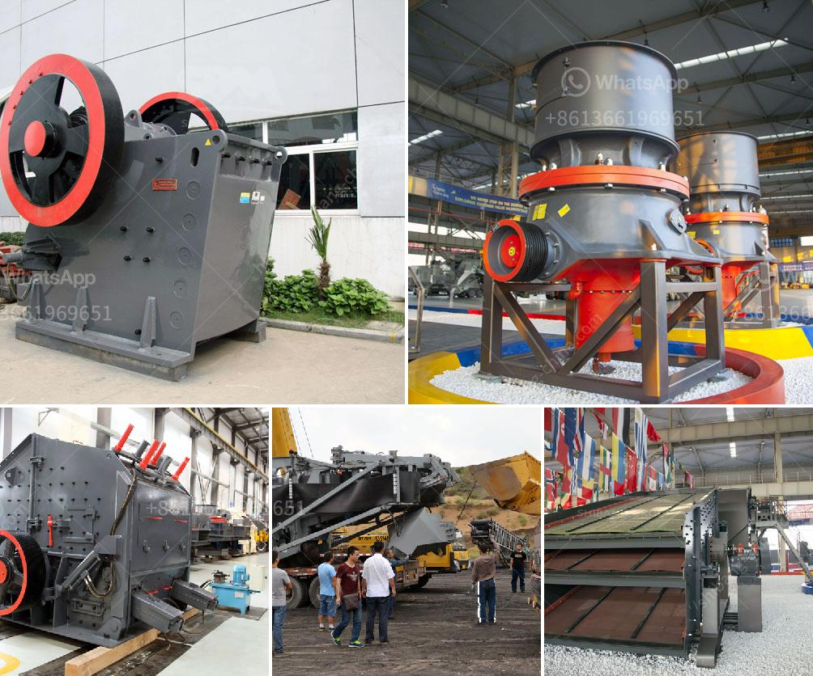

<h3>crusher supplier in saudi arabia</h3>
Saudi Arabia is known to be one of the largest and most progressive countries in the Middle East, with thriving industries and a strong economy. The construction and building sector is a key contributor to the country’s growth, and crusher suppliers play a vital role in this industry.

Crusher suppliers provide the raw materials needed in the construction industry to build highways, bridges, airports, hospitals, schools and homes. These materials include gravel, sand, crushed stones, and other similar products. They are crucial for any construction project, as they provide the foundation and support for the structures being built.

In Saudi Arabia, there are several crusher suppliers that provide high-quality materials and reliable services to the construction industry. These suppliers have decades of experience in delivering crushing and screening equipment and have obtained ISO 9001 quality certifications. They provide a wide range of products, including crushers, screens, feeders, belt conveyors, and complete mobile crushing and screening plants.

One of the leading crusher suppliers in Saudi Arabia is HSB, which has been catering to the needs of construction companies in the region for the past four decades. HSB supplies the highest quality materials to its customers, ensuring that their construction projects are completed on time and within budget. They have a reputation for providing excellent customer service and delivering products that meet the highest international standards.

HSB offers a wide range of crushers, including jaw crushers, cone crushers, impact crushers, and vertical shaft impact crushers. These crushers are designed to produce high-quality aggregates that are used in a variety of construction applications. They are also equipped with advanced features and technologies that optimize the crushing process and maximize the production output.

In addition to crusher equipment, HSB also provides spare parts, maintenance, and repair services to ensure that their customers' crushers are running smoothly and efficiently. They have a team of skilled technicians and engineers who can quickly diagnose and fix any issues that may arise with the crushers.

HSB understands the importance of sustainable development and environmental responsibility. They strive to minimize the environmental impact of their operations by implementing efficient waste management and recycling practices. They also promote the use of energy-efficient equipment and technologies to reduce carbon emissions.

In conclusion, crusher suppliers in Saudi Arabia play a vital role in the construction industry, providing the essential materials needed for various construction projects. They offer a wide range of crushers, along with spare parts, maintenance, and repair services, ensuring that construction companies have access to high-quality equipment and support. HSB is one such crusher supplier that has been serving the needs of construction companies in Saudi Arabia for decades, delivering top-notch products and excellent customer service.
<h3>Contact us</h3><ul><li><strong>Whatsapp:&nbsp;<a href="https://wa.me/8613661969651">+8613661969651</a></strong></li><li><a href="https://swt.shibang-china.com/?git&amp;zhl&amp;crusher supplier in saudi arabia"><strong>Online Service(chat now)</strong></a></li></ul><h3>Related</h3><ul><li><a href='formula de capacidad de chancadora.md'>formula de capacidad de chancadora</a></li><li><a href='crusher machine price in saudi.md'>crusher machine price in saudi</a></li><li><a href='prices crusher prices gypsum crusher prices.md'>prices crusher prices gypsum crusher prices</a></li><li><a href='grinding garnet machine.md'>grinding garnet machine</a></li><li><a href='the process of limestone.md'>the process of limestone</a></li></ul>