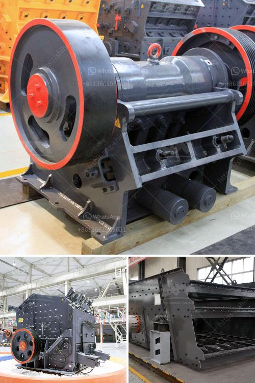

<h3>crushers for rent cincinnati</h3>
When it comes to construction and demolition projects, one thing is certain - you will inevitably have a significant amount of debris and waste to manage. Whether you're building a new structure, renovating an existing one, or simply need to clear out old materials, efficient waste management is crucial for a smooth and successful project. That's where crushers for rent in Cincinnati come in as a cost-effective and time-saving solution.

Crushers are heavy-duty machines specifically designed to break down large rocks, concrete, and other construction materials into smaller, more manageable pieces. They offer a convenient and efficient way to dispose of waste on-site, saving you the hassle and transportation costs associated with off-site disposal. Furthermore, crushers allow you to recycle and reuse materials, contributing to a more sustainable and environmentally friendly construction process.

Renting a crusher in Cincinnati offers several advantages over purchasing one outright. Firstly, it provides flexibility, allowing you to access the equipment only when you need it. This is especially beneficial for smaller projects where hiring a crusher for a short period is more cost-effective than buying one and potentially facing long-term maintenance and storage costs.

Secondly, rental crushers in Cincinnati are usually accompanied by professional technicians who can operate the equipment and ensure optimal performance. This eliminates the need for additional labor and specialized expertise on your end, allowing you to focus on other important aspects of the project.

Additionally, renting a crusher reduces the financial burden associated with purchasing and owning heavy machinery. With rental services, you can allocate your budget to other critical project expenses while still benefitting from high-quality and well-maintained equipment.

When considering crushers for rent in Cincinnati, it is important to choose a reputable rental company that offers reliable and well-maintained machinery. Look for a provider that offers a wide range of crusher options, including jaw crushers, impact crushers, cone crushers, and more. Each type of crusher has its unique features and specifications, so it is crucial to select the right one for your specific needs.

Furthermore, make sure that the rental company provides comprehensive customer support, including assistance with equipment setup, operation, and maintenance. Timely and responsive technical support can significantly reduce downtime and ensure maximum productivity throughout your project.

Before renting a crusher, assess your project requirements and objectives. Consider factors such as the materials you will be processing, the desired output size, and the expected volume of waste. This information will help you determine the type and size of crusher suitable for your needs.

In conclusion, crushers for rent in Cincinnati are a convenient and efficient solution for your crushing needs. By renting rather than buying, you can save money, time, and effort while still benefiting from high-quality equipment and professional technical support. Effective waste management is vital for any construction project, and crushers provide an excellent means of achieving it. So, whether you're working on a small renovation or a large-scale development, renting a crusher in Cincinnati is the smart choice for successful waste management and recycling.
<h3>Contact us</h3><ul><li><strong>Whatsapp:&nbsp;<a href="https://wa.me/8613661969651">+8613661969651</a></strong></li><li><a href="https://swt.shibang-china.com/?git&amp;zhl&amp;crushers for rent cincinnati"><strong>Online Service(chat now)</strong></a></li></ul><h3>Related</h3><ul><li><a href='cost of equipment used in mining lead ore.md'>cost of equipment used in mining lead ore</a></li><li><a href='models of vibrating screens.md'>models of vibrating screens</a></li><li><a href='hammer mill for ldpe grinding.md'>hammer mill for ldpe grinding</a></li><li><a href='sample quarry business plan.md'>sample quarry business plan</a></li><li><a href='nigeria crusher industries.md'>nigeria crusher industries</a></li></ul>