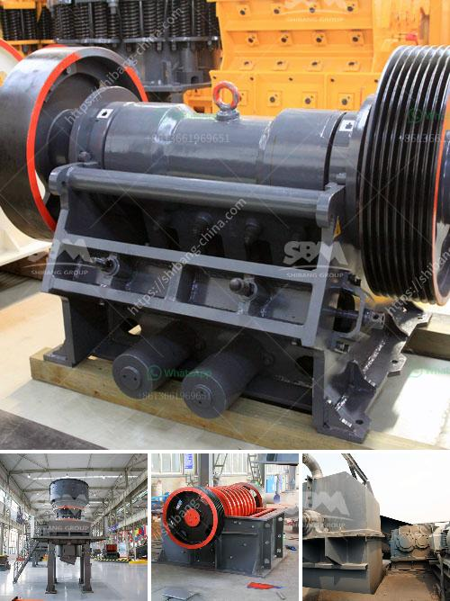

<h3>crushers stone crushers price</h3>
Crushers, also known as stone crushers, are indispensable equipment in the mining and construction industry. They are used to process large rocks into smaller stones, making them easier to transport, work with, and use in various projects. The price of these machines varies depending on several factors, including the type, capacity, and features.

One of the main factors affecting the price of stone crushers is the type of machine. There are different types of crushers available in the market, each with its own unique features and capabilities. Some common types include jaw crushers, cone crushers, impact crushers, and gyratory crushers. Each type caters to specific crushing needs, making it important for buyers to carefully consider their requirements before making a purchase.

The capacity of the stone crusher is another important consideration when determining its price. Crushers are available in different sizes and capacities, ranging from small portable units to large stationary machines. The capacity of the crusher determines how much material it can process at a given time. Higher capacity crushers are generally more expensive, as they are designed to handle larger quantities of material and offer more productivity.

In addition to the type and capacity, the features of a stone crusher also play a role in determining its price. Modern crushers come with advanced features that make the crushing process more efficient and convenient. For example, some crushers are equipped with adjustable settings, allowing users to control the size of the output material. Others may have built-in screens or conveyors, simplifying the overall process and reducing the need for additional equipment. These advanced features can increase the price of the machine, but they also enhance its overall value and performance.

Apart from the machine specifications, there are other external factors that can influence the price of stone crushers. The demand for crushers in the market plays a significant role in pricing. If the demand is high, manufacturers may increase the price to maximize profits. On the other hand, during periods of low demand, manufacturers may lower the price to attract buyers. Economic factors, such as inflation, currency exchange rates, and manufacturing costs, can also impact the pricing of crushers.

When considering the price of stone crushers, it is crucial to find a balance between affordability and functionality. While it may be tempting to opt for the cheapest option available, this might compromise the quality and durability of the machine, leading to higher maintenance and replacement costs in the long run. It is advisable to choose a reputable manufacturer known for producing high-quality crushers with reasonable pricing.

In conclusion, the price of stone crushers can vary significantly depending on factors such as type, capacity, features, demand, and economic conditions. Buyers should carefully evaluate their requirements and budget to make an informed decision. Investing in a reliable and efficient stone crusher can contribute to overall productivity and profitability in various industries, making it a worthwhile investment.
<h3>Contact us</h3><ul><li><strong>Whatsapp:&nbsp;<a href="https://wa.me/8613661969651">+8613661969651</a></strong></li><li><a href="https://swt.shibang-china.com/?git&amp;zhl&amp;crushers stone crushers price"><strong>Online Service(chat now)</strong></a></li></ul><h3>Related</h3><ul><li><a href='mobile crushing price.md'>mobile crushing price</a></li><li><a href='mtm 70 ball mill how much capacity.md'>mtm 70 ball mill how much capacity</a></li><li><a href='picture of complete of quarry crushing plant nigeria.md'>picture of complete of quarry crushing plant nigeria</a></li><li><a href='set up a quarry business.md'>set up a quarry business</a></li><li><a href='buy gravel crusher.md'>buy gravel crusher</a></li></ul>