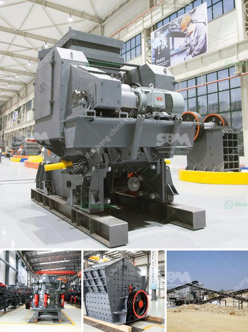

<h3>crushing & screening plant</h3>
Crushing and screening plants are machinery used for crushing, screening, and washing coal, minerals, rock aggregates, and other materials. They are widely used in mining, metallurgy, chemical, and construction industries to reduce the size of raw materials and separate impurities for further processing or end-use.

A typical crushing and screening plant consists of a primary crusher, secondary crusher, vibrating screens, a variety of conveyors, and washing equipment. Each equipment plays a crucial role in the line, ensuring effective and efficient operations. The primary crusher, usually a jaw or gyratory crusher, breaks the raw material into manageable sizes. The secondary crusher, often a cone crusher or impact crusher, further reduces the size of the material to the desired specifications.

Vibrating screens efficiently separate the crushed material into different sizes, ensuring quality control and uniformity. They can be configured to various deck arrangements and mesh sizes to suit specific applications. The screened material is then conveyed to different stockpiles or further processing equipment.

In addition to crushing and screening, washing equipment is essential for removing impurities from the material. This is particularly important for materials such as coal or minerals that require cleaning before use. Washing equipment typically includes a variety of conveyors, dewatering screens, and cyclones to remove contaminants and achieve desired specifications.

The versatility of crushing and screening plants allows them to be used for a wide range of applications. They are crucial in the mining industry for extracting valuable minerals from the earth. In construction, these plants are used for processing aggregates, such as gravel and sand, for use in roads, bridges, and buildings. They are also utilized in recycling operations to crush and repurpose materials.

Crushing and screening plants are designed to be highly efficient and productive, with minimal downtime. They are equipped with advanced technologies for easy operation, maintenance, and monitoring. Additionally, they can be tailored to meet specific requirements and regulations, ensuring compliance and environmental sustainability.

Overall, crushing and screening plants are vital for various industries as they facilitate the processing of raw materials into usable products. With advancements in technology, these plants continue to improve efficiency, reduce environmental impact, and contribute to the development of sustainable industries.
<h3>Contact us</h3><ul><li><strong>Whatsapp:&nbsp;<a href="https://wa.me/8613661969651">+8613661969651</a></strong></li><li><a href="https://swt.shibang-china.com/?git&amp;zhl&amp;crushing  screening plant"><strong>Online Service(chat now)</strong></a></li></ul><h3>Related</h3><ul><li><a href='price of quarry crusher in zambia.md'>price of quarry crusher in zambia</a></li><li><a href='philippine crushing machine.md'>philippine crushing machine</a></li><li><a href='wet process of cement.md'>wet process of cement</a></li><li><a href='kaolin clay mining crusher in malaysia.md'>kaolin clay mining crusher in malaysia</a></li><li><a href='caterpillar impact crusher.md'>caterpillar impact crusher</a></li></ul>