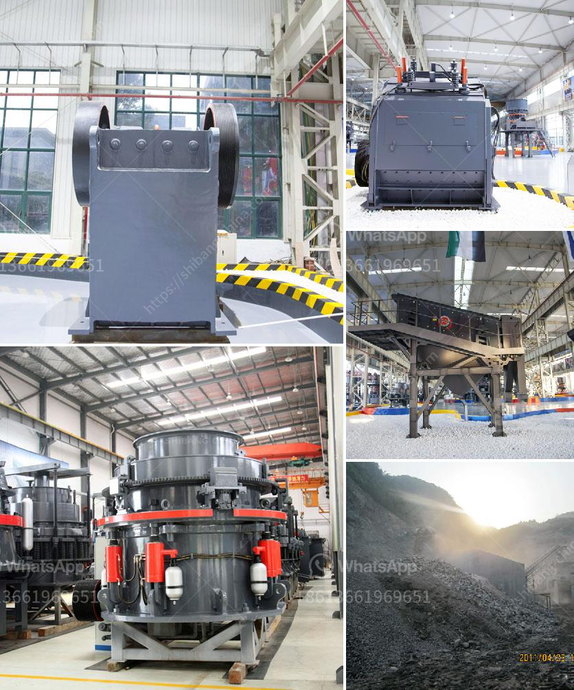

<h3>crushing aggregates companies in philippines</h3>
In the Philippines, the construction industry plays a crucial role in fostering economic growth and development. With the growing population and rapid urbanization, there is an increasing demand for quality infrastructure, thus driving the need for aggregates - crushed stones, gravel, and sand. As such, crushing aggregates companies have emerged as key players in supporting the nation's construction growth trajectory.

Aggregates, commonly derived from crushed stones, gravel, and sand, are vital components of construction materials used in various infrastructure projects. Examples include buildings, roadways, bridges, airports, railways, and even land reclamation projects.

These materials serve as the foundation for sturdy and resilient structures, ensuring structural integrity and durability. Moreover, high-quality aggregates contribute to enhancing the overall aesthetic and functional aspects of construction projects.

Despite the rising demand for aggregates, crushing companies in the Philippines face several challenges. One of the primary obstacles is the acquisition of suitable sources for aggregates extraction. The availability of quality mines poses a significant challenge due to the continuous demand and environmental concerns.

Additionally, transportation logistics play a key role in ensuring the efficient delivery of aggregates to construction sites. Establishing transportation networks can be costly and time-consuming, particularly in archipelagic countries like the Philippines. Therefore, these companies must invest in well-maintained fleets and efficient logistics management systems to streamline operations.

Furthermore, the aggregates industry must adhere to strict regulations regarding environmental preservation, health, and safety standards. Executing responsible mining practices, ensuring rehabilitation of mining sites, and mitigating dust and noise pollution are essential factors that companies have to address.

Despite these challenges, crushing aggregates companies in the Philippines have shown resilience, adaptability, and innovation in an ever-changing landscape. By developing state-of-the-art machinery, implementing technological advancements, and adopting sustainable mining practices, they have established a robust industry.

The growth of these companies has contributed significantly to the country's economy. They generate employment opportunities, both direct and indirect, providing livelihoods to thousands of Filipinos. Furthermore, the industry indirectly supports related sectors such as transportation, manufacturing, and engineering, consequently driving economic activity.

Moreover, these companies have invested in research and development to improve the quality of aggregates produced. By incorporating modern crushing techniques, companies can now provide high-quality materials that meet international standards. This has spurred infrastructural development, attracting local and foreign investors who are looking to capitalize on the Philippines' thriving construction industry.

Crushing aggregates companies in the Philippines play a vital role in supporting the nation's construction sector. Despite the challenges they face, such as sourcing suitable aggregates, transportation logistics, and strict environmental regulations, these companies have thrived and established themselves as key players in the industry.

Their commitment to innovation, investment in technology, and adherence to sustainable mining practices have led to the production of high-quality aggregates. Consequently, this has enabled the Philippines to build resilient infrastructure, enhance economic growth, and attract foreign investments.

Moving forward, it is crucial for stakeholders to continue supporting these companies and provide an enabling environment for their growth. By addressing challenges together, the aggregates sector will continue to thrive and contribute to the continued progress of the Philippines' construction industry.
<h3>Contact us</h3><ul><li><strong>Whatsapp:&nbsp;<a href="https://wa.me/8613661969651">+8613661969651</a></strong></li><li><a href="https://swt.shibang-china.com/?git&amp;zhl&amp;crushing aggregates companies in philippines"><strong>Online Service(chat now)</strong></a></li></ul><h3>Related</h3><ul><li><a href='stone crusher and quarry plant in galway ireland.md'>stone crusher and quarry plant in galway ireland</a></li><li><a href='clay ceromic manufacturing process.md'>clay ceromic manufacturing process</a></li><li><a href='how much is a gold crusher in kenya.md'>how much is a gold crusher in kenya</a></li><li><a href='charcoal crusher kenya.md'>charcoal crusher kenya</a></li><li><a href='crushing machine in philippines.md'>crushing machine in philippines</a></li></ul>