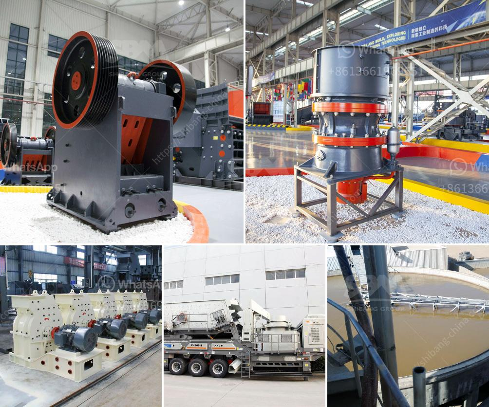

<h3>crushing and screening distributing in philippines</h3>
Crushing and screening equipment plays a crucial role in various industries, such as mining, construction, and recycling. In the Philippines, the demand for this equipment has been steadily rising due to the rapid development of infrastructure projects across the country. As a result, the need for crushing and screening distributing companies has become paramount in meeting these demands efficiently.

One of the primary reasons why crushing and screening equipment is vital in the Philippines is the construction boom happening nationwide. The government has allocated a significant budget for the construction and improvement of highways, bridges, schools, hospitals, and other vital infrastructure. These projects require high-quality aggregates, which can only be produced through the use of crushing and screening equipment.

Furthermore, the mining industry in the Philippines also relies heavily on crushing and screening equipment. The country is known for its rich mineral resources, including gold, copper, and nickel. To extract these valuable minerals, mining companies need powerful crushers and screens to break down the raw materials into smaller sizes for further processing.

In response to the increasing demand, many crushing and screening equipment manufacturers have established their presence in the Philippines. These companies provide a wide range of equipment, including jaw crushers, cone crushers, impact crushers, screens, and conveyors. They also offer comprehensive after-sales services such as installation, maintenance, and parts supply, ensuring the uninterrupted operation of their customers' equipment.

Additionally, these distributing companies work closely with their customers to provide customized solutions based on their specific requirements. They analyze the project needs, evaluate the site conditions, and recommend the most suitable equipment to maximize productivity and efficiency.

The role of crushing and screening distributing companies in the Philippines goes beyond supplying equipment. They play a crucial part in supporting the growth of various industries by ensuring the availability of high-quality aggregates and assisting in the extraction of valuable minerals. With their expertise and dedication, these companies contribute to the continued development of the country's infrastructure and economy.
<h3>Contact us</h3><ul><li><strong>Whatsapp:&nbsp;<a href="https://wa.me/8613661969651">+8613661969651</a></strong></li><li><a href="https://swt.shibang-china.com/?git&amp;zhl&amp;crushing and screening distributing in philippines"><strong>Online Service(chat now)</strong></a></li></ul><h3>Related</h3><ul><li><a href='small scale crushers in south africa.md'>small scale crushers in south africa</a></li><li><a href='sand crushing machine.md'>sand crushing machine</a></li><li><a href='bentonite plant german.md'>bentonite plant german</a></li><li><a href='china cement grinding unit manufacturers.md'>china cement grinding unit manufacturers</a></li><li><a href='tanzania gold crusher price.md'>tanzania gold crusher price</a></li></ul>