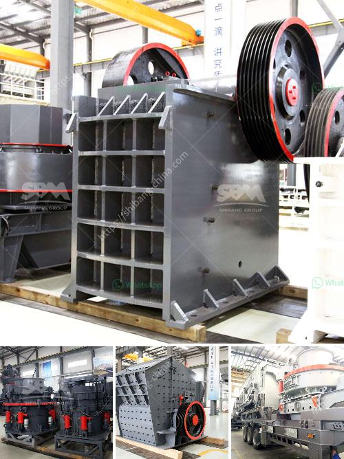

<h3>crushing efficiency of ball mill</h3>
A ball mill, a type of grinder, is a cylindrical device used in grinding (or mixing) materials like ores, chemicals, ceramic raw materials, and paints. Ball mills rotate around a horizontal axis, partially filled with the material to be ground plus the grinding medium. Different materials are used as media, including ceramic balls, flint pebbles, and stainless steel balls. An internal cascading effect reduces the material to a fine powder.

Ball mills can operate in either wet or dry conditions, depending on the materials being ground and the mill configuration. In wet grinding, the mill is usually loaded with a certain amount of water or other liquid. This slurry is fed into the ball mill continuously and the ground material is discharged through a system of screens or a hydrocyclone.

Crushing efficiency of ball mill is defined as the ratio of the valuable material obtained to the weight of the material ground. The efficiency of a ball mill depends on the number of contact points between the balls. These contact points are determined by the size of the balls and the diameter of the mill. The optimal ball size for efficient grinding depends on the feed size, the desired product size, and the mill dimensions.

To evaluate the grinding efficiency of a ball mill, various aspects and factors that affect the efficiency of the ball mill are studied. The most common factors influencing the grinding efficiency are the residence time of the material in the mill, the rotational speed of the mill, the grinding media diameter, and the desired fineness of the ground material.

One of the key factors that affect the efficiency of a ball mill is the material feed rate. Increasing the feed rate increases the chance of impaction and attrition between the grinding media and the material being ground, resulting in faster grinding and higher efficiency. However, increasing the feed rate beyond a certain limit can lead to overloading of the mill and decreased efficiency.

The residence time of the material in the mill is another critical factor that affects the efficiency. The longer the material stays in the mill, the more chances it has to be ground. However, if the residence time is too long, it can lead to over-grinding and excessive energy consumption. Therefore, finding the optimal residence time is crucial for maximizing the grinding efficiency.

The rotational speed of the mill also plays a significant role in determining the grinding efficiency. Higher rotational speeds result in more intense grinding action and faster particle size reduction. However, excessively high speeds can lead to excessive wear and energy consumption. Therefore, finding the optimal rotational speed is essential for achieving the desired efficiency.

The grinding media diameter is another key factor influencing the efficiency of a ball mill. A larger diameter of the grinding media results in more contact points between the balls and more effective grinding. However, increasing the diameter beyond a certain limit can lead to decreased efficiency due to increased power consumption and decreased grinding efficiency.

In conclusion, the crushing efficiency of a ball mill is influenced by various factors, including the feed rate, residence time, rotational speed, and grinding media diameter. Finding the optimal values for these parameters is crucial for maximizing the grinding efficiency and obtaining the desired product size. Continuous monitoring and adjustment of these factors can lead to significant improvements in the overall efficiency of ball milling operations.
<h3>Contact us</h3><ul><li><strong>Whatsapp:&nbsp;<a href="https://wa.me/8613661969651">+8613661969651</a></strong></li><li><a href="https://swt.shibang-china.com/?git&amp;zhl&amp;crushing efficiency of ball mill"><strong>Online Service(chat now)</strong></a></li></ul><h3>Related</h3><ul><li><a href='roller mill pulverizer ofto 5 tons per hour price.md'>roller mill pulverizer ofto 5 tons per hour price</a></li><li><a href='granite quarry machines.md'>granite quarry machines</a></li><li><a href='cement factory for sale in andra pradesh.md'>cement factory for sale in andra pradesh</a></li><li><a href='buy stone crusher india.md'>buy stone crusher india</a></li><li><a href='cost of barite crusher in nigeria.md'>cost of barite crusher in nigeria</a></li></ul>