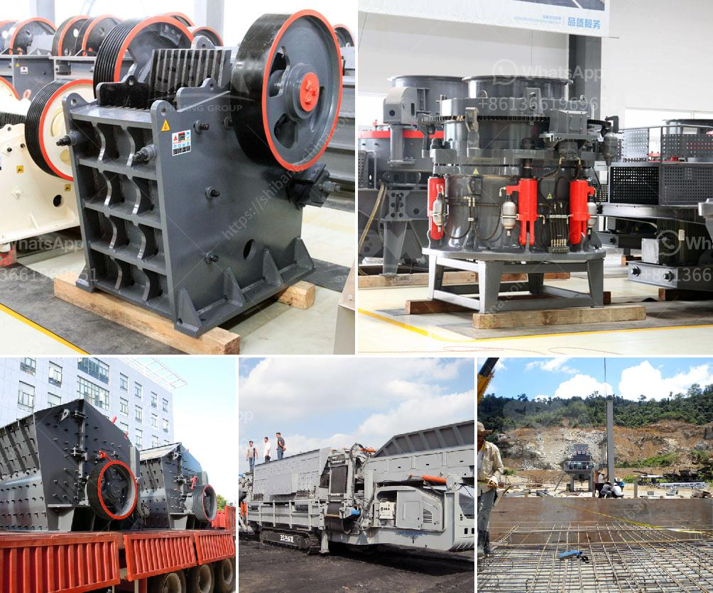

<h3>crushing machine in philippines</h3>
In the Philippines, crushing machines are widely used for crushing stones into small particles for construction aggregate production and mineral resources development. Jaw crusher is one of the most commonly used crushing equipment in the mining industry. It has the characteristics of large crushing ratio, uniform product size, simple structure, reliable operation, easy maintenance, and low operating cost.

Nowadays, jaw crusher is popular in the Philippines due to its high capacity and low energy consumption. Jaw crusher is mainly used for coarse crushing of all kinds of materials. It is widely used in mining, smelting, building materials, highways, railways, water conservancy and chemical industries, etc. As a crushing machine, the jaw crusher's crushing ratio is large and the product size is even. With durable and reliable performance, the jaw crusher has exported to over 90 countries, such as the Philippines, Mexico, Vietnam, Kazakhstan, and other countries and regions.

Compared with the traditional jaw crusher, there are many types of jaw crushers nowadays. The most popular ones are the PE series jaw crusher, PEW series jaw crusher, and the European version jaw crusher, etc. These jaw crushers are widely used in the mining, metallurgy, building materials, highway, railway, water conservancy, and chemical industries, etc.

On the other hand, the impact crusher is used to crush medium-hard rock in many industries such as metallurgy, construction, and chemistry. The feeding size of the impact crusher is less than 500mm, and the compressive strength of the materials to be crushed is not more than 350MPa. The impact crusher is widely used in the water conservancy, highway, and construction industries.

Crushing machines are used in different industries like mining, agriculture, and construction to reduce the size of raw materials and raw materials for further processing. Some crushing machines even have the capability to recycle waste materials. The process of crushing differs based on the purpose of the material being crushed and the surrounding environment.

One great example of crushing machines is the crushing plant that crushes large stones into smaller pieces for use in construction or other purposes. Crushing plants are often used in aggregate production, which means they are commonly used in recycling construction waste, concrete, bricks, and asphalt. This can vary from a 0.5 metric ton mobile crushing plant to a 10 metric ton stationary crushing plant.

Other crushing machines are used to reduce the size of rocks and ores for different industries such as mining, transportation, energy, petrochemical, and construction. Some popular machines used in this industry include impact crushers, hammer crushers, VSI crushers, cone crushers, ball mills, hydraulic cone crushers, and gyratory crushers.

In conclusion, crushing machines are essential equipment in the Philippines mining industry, construction industry, and other industries. The efforts of a crushing machine in the Philippines range from ore mining to recycling and disaster relief. Many mining equipment and crushing machine manufacturers are working in the Philippines. They supply a large range of machines for crushing different types of rocks and stones. The crushing equipment mainly performs crushing operations on various types of stone materials. According to the principle of crushing and the different particle sizes, it is divided into many models. The Philippines has a variety of jaw crushers that can be used in the mining industry for different purposes. In the Philippines, crushers are used by numerous industries, such as mining, construction, metallurgy, and many more.
<h3>Contact us</h3><ul><li><strong>Whatsapp:&nbsp;<a href="https://wa.me/8613661969651">+8613661969651</a></strong></li><li><a href="https://swt.shibang-china.com/?git&amp;zhl&amp;crushing machine in philippines"><strong>Online Service(chat now)</strong></a></li></ul><h3>Related</h3><ul><li><a href='used crusher for sale from iran.md'>used crusher for sale from iran</a></li><li><a href='basin a grinding roller mill.md'>basin a grinding roller mill</a></li><li><a href='hammer mills for sale at saro zambia.md'>hammer mills for sale at saro zambia</a></li><li><a href='part of ball mills.md'>part of ball mills</a></li><li><a href='ball mill china making.md'>ball mill china making</a></li></ul>