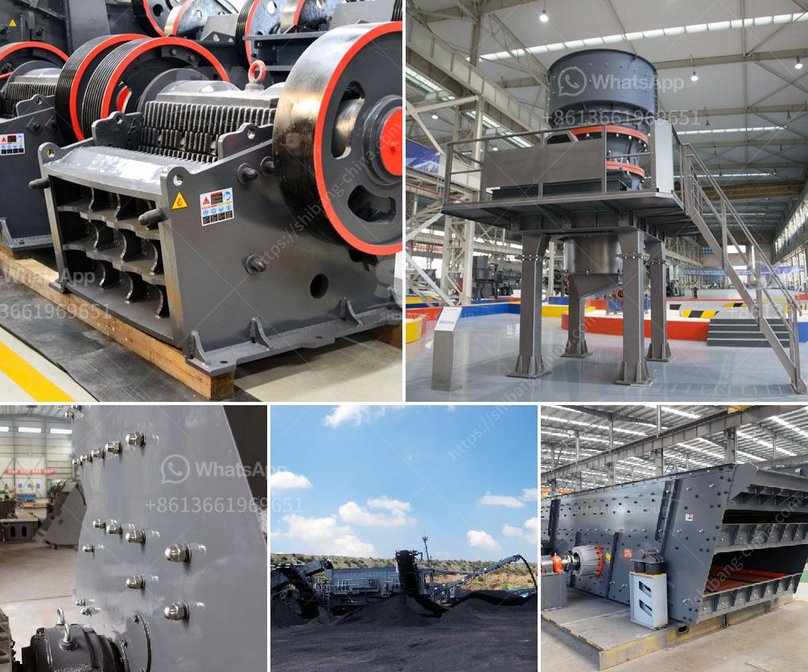

<h3>crushing media liner manufacturers</h3>
Media liners play a crucial role in various industrial applications, particularly in the mining and aggregate industries. They provide protection to machinery against wear and erosion caused by the abrasive materials they handle. As the demand for efficient and long-lasting liners grows, so does the pressure on manufacturers to deliver high-quality products. In this article, we will explore the importance of crushing media liner manufacturers and how they strive to meet industry demands.

One key aspect that sets a reputable crushing media liner manufacturer apart is their commitment to using top-grade materials. These manufacturers understand that durability and performance are paramount in the mining and aggregate sectors. By sourcing premium wear-resistant materials, such as high-chrome white irons, they ensure that their liners can withstand even the toughest operating conditions. By employing advanced manufacturing techniques, these manufacturers produce liners that offer superior impact and wear resistance, significantly extending the lifespan of machinery.

Moreover, crushing media liner manufacturers continually invest in research and development to create innovative designs. Their engineers work closely with industry experts to develop liners that optimize productivity, reduce downtime, and lower overall operational costs. By applying cutting-edge technologies and analytics, manufacturers can identify areas for improvement and refine their products accordingly.

Apart from product quality, timely delivery is another crucial aspect. Efficient and reliable crushing media liner manufacturers understand the significance of meeting customer deadlines. They maintain well-defined production schedules, implement streamlined processes, and maintain adequate inventory levels to ensure on-time delivery. By doing so, they enable their clients to minimize downtime and enhance overall operational efficiency.

Lastly, the best manufacturers prioritize customer satisfaction. They offer personalized and responsive customer service, readily addressing client queries and concerns. By partnering with their customers, these manufacturers develop a deep understanding of their unique needs and challenges, allowing them to provide tailored solutions and support.

In conclusion, crushing media liner manufacturers play a critical role in the mining and aggregate industries by providing high-quality liners that protect machinery and drive operational efficiency. With their commitment to using superior materials, embracing innovation, delivering on time, and prioritizing customer satisfaction, these manufacturers constantly raise the bar in the industry. By partnering with reputable manufacturers, businesses can ensure the longevity and optimal performance of their equipment, ultimately contributing to the growth and success of their operations.
<h3>Contact us</h3><ul><li><strong>Whatsapp:&nbsp;<a href="https://wa.me/8613661969651">+8613661969651</a></strong></li><li><a href="https://swt.shibang-china.com/?git&amp;zhl&amp;crushing media liner manufacturers"><strong>Online Service(chat now)</strong></a></li></ul><h3>Related</h3><ul><li><a href='artificial stone production line.md'>artificial stone production line</a></li><li><a href='picture of complete of quarry crushing plant nigeria.md'>picture of complete of quarry crushing plant nigeria</a></li><li><a href='part of ball mills.md'>part of ball mills</a></li><li><a href='quarry crusher equipment for sale brisbane.md'>quarry crusher equipment for sale brisbane</a></li><li><a href='granite crusher south africa.md'>granite crusher south africa</a></li></ul>