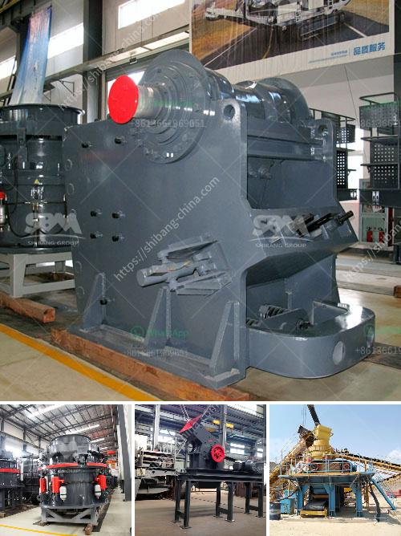

<h3>crushing mineral crushing meaning</h3>
Crushing mineral crushing meaning refers to the process of breaking down large rocks or minerals into smaller pieces. This is a crucial step in various industries such as mining, construction, and geology. The purpose is to extract valuable materials or prepare them for further processing.

Minerals are naturally occurring inorganic substances with defined chemical compositions. They come in various forms such as rocks, ores, and precious stones. However, these substances are often found in their raw and unrefined state, making them unsuitable for immediate use. This is where crushing mineral crushing meaning comes into play.

The process involves the use of heavy machinery and equipment designed specifically for crushing rocks or minerals. Jaw crushers, impact crushers, and cone crushers are some common examples. These machines exert immense pressure and force to break down the materials into smaller fragments. This allows for easier handling, transportation, and processing.

Crushing mineral crushing meaning has several benefits. Firstly, it increases the surface area of the minerals, exposing a larger area for chemical reactions to occur. This is particularly important when extracting valuable metals from ores. Secondly, it enhances the efficiency of downstream processes like grinding and milling. Smaller particles are easier to grind, resulting in reduced energy consumption and faster production rates.

Moreover, crushing also aids in the separation of different minerals based on their physical properties such as density and size. For instance, in mining operations, crushed ores are often subjected to a process called beneficiation, which involves separating valuable minerals from gangue or waste materials.

In summary, crushing mineral crushing meaning is a crucial step in various industries for extracting and preparing valuable materials. It helps break down large rocks or minerals into smaller fragments, improving their surface area for chemical reactions and enhancing downstream processes. With the aid of heavy machinery, this process contributes to the efficiency and productivity of industries like mining, construction, and geology.
<h3>Contact us</h3><ul><li><strong>Whatsapp:&nbsp;<a href="https://wa.me/8613661969651">+8613661969651</a></strong></li><li><a href="https://swt.shibang-china.com/?git&amp;zhl&amp;crushing mineral crushing meaning"><strong>Online Service(chat now)</strong></a></li></ul><h3>Related</h3><ul><li><a href='grinding mill for limestone italy.md'>grinding mill for limestone italy</a></li><li><a href='stone crushing plant use jaw crusher price list.md'>stone crushing plant use jaw crusher price list</a></li><li><a href='small stone crusher price in india.md'>small stone crusher price in india</a></li><li><a href='quartz crushing machine price.md'>quartz crushing machine price</a></li><li><a href='ball mill china making.md'>ball mill china making</a></li></ul>