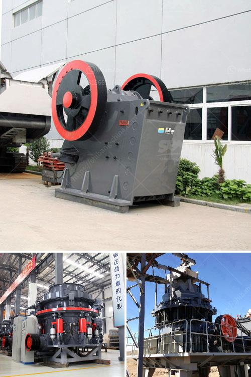

<h3>crushing of gold mining dust</h3>
Gold mining has long been associated with great wealth and prosperity. However, it also leaves behind a trail of destruction in the form of mining dust, which poses significant environmental and health hazards. To combat these concerns, a new method has emerged in recent years – the crushing of gold mining dust. This innovative approach not only addresses the immediate problem but also presents an opportunity to create a sustainable future for both the industry and the environment.

Gold mining dust, often referred to as tailings, is a byproduct of the gold extraction process. It consists of finely ground rock particles mixed with water, chemicals, and other substances used to extract gold from the ore. Traditionally, these tailings were stored in tailings ponds, which are large reservoirs constructed to hold and contain the waste material. However, the storage of vast quantities of tailings has proven to be problematic.

One of the major issues associated with tailings ponds is the risk of dam failures. Over the years, there have been numerous incidents where tailings ponds have breached, leading to catastrophic environmental and human consequences, such as the 2019 Brumadinho dam disaster in Brazil. These failures release a tremendous amount of mining dust into nearby rivers, causing pollution and endangering aquatic life. Moreover, the presence of toxic substances in tailings, such as mercury and cyanide, further exacerbates the environmental impact.

The crushing of gold mining dust offers a compelling solution to these pressing concerns. By pulverizing the tailings into smaller particles, the dust becomes more manageable and less harmful. This process breaks down the fine rock particles, enabling easier handling and reducing the risk of dispersal into surrounding areas. It effectively transforms the tailings from a problematic byproduct into a potentially valuable resource.

Additionally, crushing the gold mining dust opens up avenues for reprocessing. The pulverized tailings can undergo further extraction processes to recover any remaining gold particles. This not only increases the economic returns for mining companies but also minimizes the amount of waste left behind. By treating tailings as a potential source of gold, the crushing approach adds an extra layer of sustainability to the mining industry.

Furthermore, the crushed tailings can be exploited for environmentally friendly purposes. For example, they can be used in construction materials, such as bricks or concrete, reducing the need for extracting natural resources. Utilizing tailings in this manner not only reduces the environmental impact of mining but also reduces waste generation, contributing to a more circular economy.

While the crushing of gold mining dust holds significant promise, its implementation requires careful planning and monitoring. Adequate infrastructure and technology must be in place to safely carry out the crushing process and prevent further environmental contamination. Strict regulations and oversight are essential to ensure compliance and minimize potential risks.

In conclusion, the crushing of gold mining dust presents a viable solution to the environmental concerns associated with tailings. By pulverizing the dust, it becomes more manageable and can be repurposed to extract any remaining gold particles. This innovative approach not only reduces the immediate harm caused by mining dust but also offers a sustainable path for the future. With proper planning and oversight, the crushing of gold mining dust can lead to a more environmentally friendly and economically viable mining industry.
<h3>Contact us</h3><ul><li><strong>Whatsapp:&nbsp;<a href="https://wa.me/8613661969651">+8613661969651</a></strong></li><li><a href="https://swt.shibang-china.com/?git&amp;zhl&amp;crushing of gold mining dust"><strong>Online Service(chat now)</strong></a></li></ul><h3>Related</h3><ul><li><a href='aggregate for cement block making.md'>aggregate for cement block making</a></li><li><a href='mineral grinding corporation.md'>mineral grinding corporation</a></li><li><a href='list of all the equipment for gold mining.md'>list of all the equipment for gold mining</a></li><li><a href='limestone crusher limestone crusher equipment.md'>limestone crusher limestone crusher equipment</a></li><li><a href='conveyor belts for material.md'>conveyor belts for material</a></li></ul>