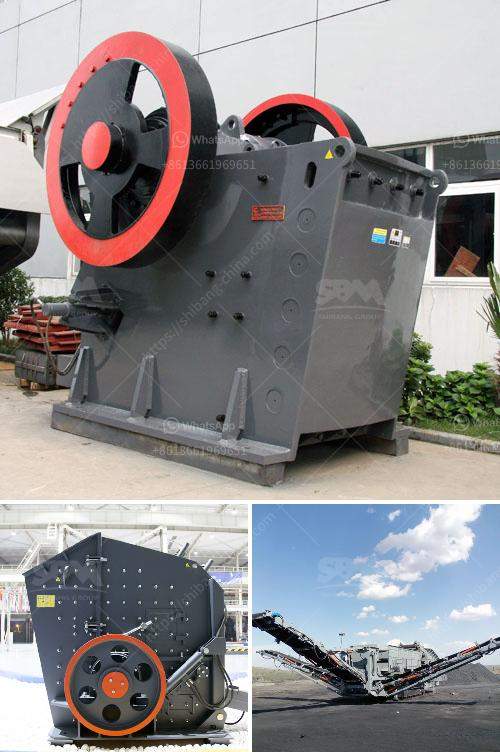

<h3>crushing plant for aggregate india</h3>
Crushing plant for aggregate India plays a crucial role in the construction industry. Aggregate is the ballast stone that is used as a structural material in various construction projects such as roads, railways, bridges, buildings, canals, etc. It is a fine aggregate that is produced by crushing stone, gravel, or slag. India is one of the largest producers of aggregates, contributing significantly to the country's infrastructure development.

In India, the crushing plant for aggregate is very important due to its role in generating revenue, employment opportunities, and overall economic growth. The construction sector in India is growing rapidly, and the demand for aggregates is ever-increasing. As a result, more and more crushing plants are being established in the country to meet the growing demand for aggregate.

One of the main advantages of the crushing plant for aggregate India is its versatility. It can handle a wide variety of materials, including limestone, granite, basalt, river stone, etc. The innovative design of the plant allows it to be easily adapted to different site conditions and materials, ensuring maximum efficiency and productivity. Moreover, the crushing plant can be customized according to the specific requirements of the construction project, ensuring the production of high-quality aggregates.

Apart from its role in the construction industry, the crushing plant for aggregate India also has a positive impact on the environment. It helps in minimizing the extraction of natural resources like stones and gravel that are used as aggregates. By using recycled aggregates, the plant contributes to the conservation of resources and reduces the carbon footprint. Additionally, the plant incorporates advanced dust suppression and noise reduction measures, ensuring minimal environmental impact.

In terms of economic benefits, the crushing plant for aggregate India significantly contributes to job creation and income generation. It provides employment opportunities to a large number of people, including skilled laborers, technicians, engineers, etc. The establishment of crushing plants in remote areas creates employment for local communities and helps in their overall development. Moreover, the production and sale of aggregates generate revenues for both the plant owners and the government through taxes and royalties.

To ensure the smooth operation of the crushing plant for aggregate India, regular maintenance and servicing are crucial. Regular inspection of equipment, lubrication, and replacement of worn-out parts help in maintaining optimum performance and prolonging the life of the plant. Adequate training of the plant operators also plays a vital role in preventing accidents and ensuring safe and efficient operations.

In conclusion, the crushing plant for aggregate India is a crucial component in the construction industry and plays a significant role in infrastructure development. It is versatile, environmentally friendly, and economically beneficial. With the growing demand for aggregates in India, the establishment of crushing plants has become crucial to meet the country's requirements. However, it is essential to ensure proper maintenance and training of plant operators to ensure the efficient and safe operation of the plants.
<h3>Contact us</h3><ul><li><strong>Whatsapp:&nbsp;<a href="https://wa.me/8613661969651">+8613661969651</a></strong></li><li><a href="https://swt.shibang-china.com/?git&amp;zhl&amp;crushing plant for aggregate india"><strong>Online Service(chat now)</strong></a></li></ul><h3>Related</h3><ul><li><a href='diamond mining jaw crusher.md'>diamond mining jaw crusher</a></li><li><a href='impact crushers for sale.md'>impact crushers for sale</a></li><li><a href='purchase of cement crusher machines.md'>purchase of cement crusher machines</a></li><li><a href='bauxite from cement plants in india.md'>bauxite from cement plants in india</a></li><li><a href='gypsum powder production business plan.md'>gypsum powder production business plan</a></li></ul>