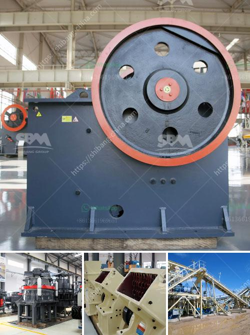

<h3>crushing plant for irion ore</h3>
Crushing plants are utilized in various stages of the mining process to break down ore into smaller pieces before further processing. The iron ore industry relies on these crushing plants to provide a finished product that can be used as a feedstock for steel production.

Crushing plants enable the effective processing of larger chunks of iron ore into more manageable sizes. This iron ore is then processed into various pellets, briquettes, and other kinds of iron formations that are used in the production of steel.

To efficiently process iron ore for high-quality steel production, frequent ore grade monitoring, during all steps of downstream processing, is mandatory. Iron ore crushing plant, when it is built and ready for operation, requires regular monitoring to be effective.

Ensuring all of the processing equipment is accurately tuned and running optimally is crucial for a productive iron ore crushing plant. To achieve optimal performance and efficiency, operators must have a deep understanding of the equipment's capabilities and limitations, diagnose problems, and ensure the smooth operation of the plant.

As the name suggests, a crushing plant is comprised of various components, including a hopper, vibrating feeder, jaw crusher, impact crusher, and other pieces of equipment that work together to meet the needs of the iron ore processing industry. When the iron ore is crushed, it passes through the crusher and is initially screened. At this stage, oversized ore pieces are identified and sent for further crushing or screening if required.

The crushed iron ore is then transported by conveyor belts to a stacker/reclaimer, where the ore can be blended to ensure uniformity in composition. From there, the ore is either conveyed directly to the blast furnace or stored for later use.

In addition to size reduction, crushing plants also play a crucial role in the beneficiation and concentration processes, which are necessary for producing high-grade iron ore concentrates. Beneficiation involves separating the desired iron ore product from impurities and additives.

Operating a crushing plant in a mining operation requires a range of safety precautions, including emergency stop systems, guards, and safety devices to prevent accidents and protect workers. Regular maintenance and inspections are carried out to prevent equipment failure and ensure the reliable operation of the crushing plant.

In conclusion, crushing plants for iron ore production play an important role in ensuring the world’s production demands for steel are met by maximizing the efficiency of the beneficiation process. The goal is to obtain magnetite concentrate with a grade of around 70% and hematite concentrate with a grade of around 63%.

As such, crushing and screening plants are increasingly important in the production process. These plants are comprised of a variety of different pieces of machinery and equipment that work in harmony to break down iron ore into usable products. With an understanding of the iron ore crushing process and how these plants work, operators can maximize their productivity and minimize downtime.
<h3>Contact us</h3><ul><li><strong>Whatsapp:&nbsp;<a href="https://wa.me/8613661969651">+8613661969651</a></strong></li><li><a href="https://swt.shibang-china.com/?git&amp;zhl&amp;crushing plant for irion ore"><strong>Online Service(chat now)</strong></a></li></ul><h3>Related</h3><ul><li><a href='mobile chrome ore plant.md'>mobile chrome ore plant</a></li><li><a href='crawler mobile crushing plants.md'>crawler mobile crushing plants</a></li><li><a href='mobile concrete crusher trailer mounted.md'>mobile concrete crusher trailer mounted</a></li><li><a href='stone crushing plant keesara.md'>stone crushing plant keesara</a></li><li><a href='hammer mill for plants.md'>hammer mill for plants</a></li></ul>