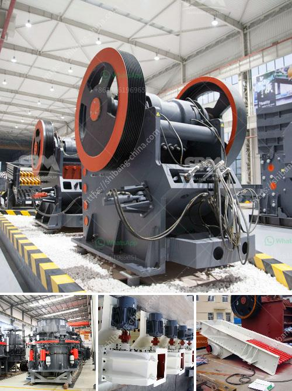

<h3>crushing plant layout</h3>
Crushing plant is an essential equipment for construction works. With the increasing demands of various construction materials, the importance of crushing plants cannot be underestimated. In a bid to provide aggregate solutions, whether it is for infrastructure development, residential and commercial buildings, or industrial construction, a crushing plant is needed. That being said, a well-designed and efficient crushing plant layout plays a crucial role in the improvement of the construction process.

A crushing plant layout is a combination of different components. Like feeders, crushers, conveyors, and hoppers, these crucial components require careful consideration and design. The arrangement of these elements greatly impacts plant performance and operational efficiency. In designing a proper layout, careful attention should be paid to the structural design, electrical and automation design, and equipment selection.

The first step in the process of designing a crushing plant layout is to determine the desired end product specifications. This includes the particle size distribution and particle shape requirements. It is also important to consider the required production capacity and the type and quality of the materials to be crushed. These factors will greatly influence the selection of crushers and the configuration of the plant.

Once the specifications are determined, the structural design of the crushing plant should be considered. The layout of the plant should provide easy access for maintenance and repairs. The design should also consider the transportation of the materials from the quarry or the mine to the plant. Additionally, the layout should ensure the proper positioning of the crushers to maximize their efficiency and minimize the energy consumption.

Another significant aspect of the crushing plant layout is the electrical and automation design. This includes the selection and arrangement of electrical components, like motors, starters, and control panels. The design should ensure the safety and reliability of the electrical system, as well as provide a user-friendly interface for operators. Efficient automation can also help optimize plant performance, from controlling the feed rate to monitoring the crusher settings.

The selection of equipment also plays a crucial role in the crushing plant layout. It is important to choose crushers that can handle the specific material properties and process requirements. Factors such as the hardness and abrasiveness of the material, as well as the desired end product size, influence the selection of crushers. Conveyor systems and screens should also be carefully selected to match the specific requirements of the material and the plant layout.

In conclusion, a well-designed crushing plant layout is essential for the efficient and effective production of construction materials. It involves careful consideration of various factors, including the desired end product specifications, structural design, electrical and automation design, and equipment selection. By paying attention to these aspects, construction companies can ensure a smooth and productive crushing plant operation, leading to quality construction materials and successful construction projects.
<h3>Contact us</h3><ul><li><strong>Whatsapp:&nbsp;<a href="https://wa.me/8613661969651">+8613661969651</a></strong></li><li><a href="https://swt.shibang-china.com/?git&amp;zhl&amp;crushing plant layout"><strong>Online Service(chat now)</strong></a></li></ul><h3>Related</h3><ul><li><a href='japan used crushers.md'>japan used crushers</a></li><li><a href='stone crushing plant keesara.md'>stone crushing plant keesara</a></li><li><a href='price list coal crushing plant.md'>price list coal crushing plant</a></li><li><a href='crushing plant for irion ore.md'>crushing plant for irion ore</a></li><li><a href='kaolin clay mining crusher in malaysia.md'>kaolin clay mining crusher in malaysia</a></li></ul>