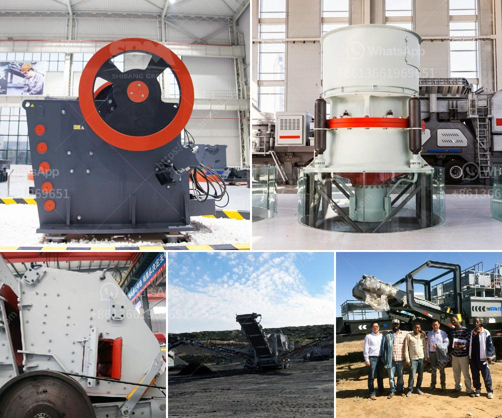

<h3>crushing plant methodology</h3>
In the world of construction, mining, and material handling, the process of crushing rocks, stones, or aggregates is essential for various applications. From building roads and bridges to producing concrete and asphalt, a crushing plant plays a crucial role in the efficient production of high-quality materials.

A crushing plant typically consists of several components, including primary, secondary, and tertiary crushers, along with screens, conveyors, and other equipment. The primary crusher, often a jaw crusher, breaks down the raw material into smaller pieces that can be further processed by secondary and tertiary crushers.

The methodology employed in a crushing plant aims to maximize productivity and minimize downtime. This starts with careful planning and design, taking into consideration the type of material to be crushed, its feed size, and desired final product gradation. Attention to detail during the design phase ensures that the plant can efficiently handle the specific requirements of the application.

Regular maintenance and inspections are critical to prevent breakdowns and ensure the plant operates at its peak performance. This includes routine checks of the crusher's wear parts, lubrication system, and electrical connections. Additionally, the plant operator should regularly monitor the material feed rate and adjust it to optimize production.

Efficient crushing plant methodology also involves continuous monitoring of the plant's performance through various sensors and instrumentations. These systems provide real-time data on important parameters such as crusher chamber pressure, power consumption, and product size distribution. Analyzing this data helps identify potential bottlenecks, optimize settings, and improve overall plant efficiency.

Furthermore, safety protocols are an integral part of any crushing plant methodology. Operators must undergo proper training to handle the equipment safely and understand the risks involved in the process. Adequate guarding, emergency stop buttons, and regular safety audits ensure a safe working environment for all personnel.

In conclusion, the methodology used in a crushing plant is crucial for streamlining the process and ensuring efficient production. From meticulous planning and design to regular maintenance and safety protocols, every step plays a vital role in achieving maximum productivity and maintaining high-quality standards. With continuous advancements in technology and innovation, crushing plants are becoming more efficient and versatile, contributing to the success of various industries worldwide.
<h3>Contact us</h3><ul><li><strong>Whatsapp:&nbsp;<a href="https://wa.me/8613661969651">+8613661969651</a></strong></li><li><a href="https://swt.shibang-china.com/?git&amp;zhl&amp;crushing plant methodology"><strong>Online Service(chat now)</strong></a></li></ul><h3>Related</h3><ul><li><a href='used crusher for sale from iran.md'>used crusher for sale from iran</a></li><li><a href='small cement grinding plant.md'>small cement grinding plant</a></li><li><a href='buy gravel crusher.md'>buy gravel crusher</a></li><li><a href='production line chrome ore concentration plant mar.md'>production line chrome ore concentration plant mar</a></li><li><a href='vibrating screens manufacturer south africa.md'>vibrating screens manufacturer south africa</a></li></ul>